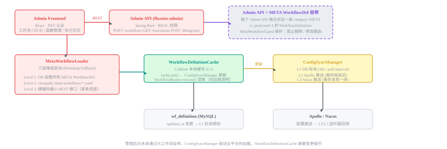
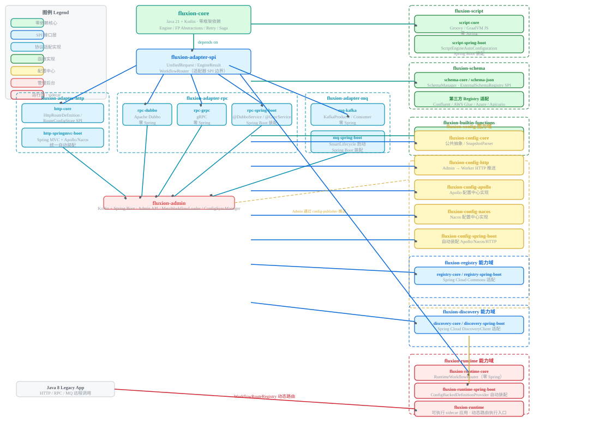

# Fluxion 函数式工作流平台

> **Fluxion** —— “意图之流”（Intent Flux + `-ion`）。一个 AI 原生的、函数式的工作流编排与执行平台：开发者表达业务意图（PRD），AI 自动解析生成可执行工作流（JSON）与函数配置，经零停机发布后由 Worker 节点动态注册路由并实时生效。

---

## 目录

- [1. 项目简介](#1-项目简介)
- [2. 设计哲学与核心特性](#2-设计哲学与核心特性)
- [3. 整体架构](#3-整体架构)
- [4. 技术栈](#4-技术栈)
- [5. 仓库结构](#5-仓库结构)
- [6. 核心概念](#6-核心概念)
- [7. 协议与适配器](#7-协议与适配器)
- [8. 控制面自举（Meta Workflows）](#8-控制面自举meta-workflows)
- [9. 函数发布机制](#9-函数发布机制)
- [10. Schema 兼容性策略](#10-schema-兼容性策略)
- [11. 长连接支持](#11-长连接支持)
- [12. 快速开始](#12-快速开始)
- [13. 开发规范与测试](#13-开发规范与测试)
- [14. 文档导航](#14-文档导航)

---

## 1. 项目简介

Fluxion 是一套**函数式工作流编排引擎 + 配置后台**的完整解决方案，包含：

- **`workflow-platform`**：基于 Kotlin + Spring Boot 3 的后端平台（控制面 Admin + 运行面 Runtime）。
- **`workflow-admin-ui`**：基于 UmiJS + React + Ant Design 5 的可视化配置后台（Schema 管理、工作流拖拽编排、函数注册、版本发布、在线调试、监控）。

平台核心能力：

- **可视化编排**：React Flow 画布拖拽，DAG 并行、条件分支、子工作流、循环等。
- **函数是一等公民**：业务原子逻辑表达为 `WorkflowFunction`，引擎零硬编码业务。
- **多协议接入**：HTTP（SpringMVC / WebFlux）、Dubbo、gRPC、Kafka、WebSocket / TCP（规划中）。
- **零停机发布**：Admin 修改定义后，Worker 通过配置中心热加载，新版本平滑替换旧版本。
- **在线调试**：即时反馈、执行历史 Pin+Replay、单步执行与执行期编辑（借鉴 n8n）。
- **可观测性**：统一 Metrics、链路追踪、错误日志、执行重放。
- **自举（Self-Hosting）**：管理后台自身由“元工作流（META）”驱动。

---

## 2. 设计哲学与核心特性

### 2.1 工作流 = 受控的调用栈

| CPU 调用栈 | Fluxion 工作流 |
|-----------|---------------|
| Stack Frame（栈帧） | `WorkflowNode`（节点） |
| return value（返回值） | `NodeOutput` — 下一节点的直接入参 |
| 函数形参（局部，不可变） | `NodeInput.directInput`（只读） |
| 调用方传递的参数 | `rawInput`（工作流原始入参） |
| 已结束帧的返回值（只读） | `ImmutableExecutionState.nodeOutputs` |
| TLS（线程本地存储） | `executionId`、`traceId` 等元信息 |
| Program Counter | `currentNode` 指针 |

**核心约束**

1. 节点函数只能看到：自己的直接入参 + 显式声明依赖的前置节点输出。
2. 节点函数不能写入共享状态 —— 返回值是唯一的输出通道。
3. 执行状态在每次节点完成后产生新的不可变快照，旧快照永久保存。

**四大核心原则**

- **Function as First-Class Citizen**：能独立编程、独立测试的逻辑都表达为 `WorkflowFunction<O>`。
- **Explicit Data Flow**：节点间依赖图可静态分析，无隐式耦合。
- **Immutable State**：天然支持重放、调试、热加载一致性。
- **Isolated Execution**：DAG 并行无锁，测试可完全隔离。

### 2.2 调度能力边界

核心引擎只负责**函数式工作流的一次性执行与编排**，**不内置**定时/延时任务调度。`TriggerType` 仅保留 `MANUAL` / `WEBHOOK` / `EVENT` / `API`（已移除 `CRON`）。周期性/延时触发建议由外部调度平台（Quartz / XXL-JOB / 延迟队列）在触发点回调已有 HTTP/RPC/MQ 入口。

### 2.3 控制面与运行面职责边界

- **Runtime（Worker）**：启动后注册到注册中心，仅负责工作流执行。
- **Admin**：统一配置、管理工作流定义。
- **注册中心**：仅用于服务发现，不承担工作流元数据同步。
- Admin 不再代理查询 Runtime 的工作流列表。

---

## 3. 整体架构

```
┌──────────────────────────────────────────────────────────────────┐
│                         客户端 / 调用方                            │
│   Browser · App · IoT · HTTP · Dubbo · gRPC · Kafka · WS/TCP      │
└───────────────┬──────────────────────────────────────────────────┘
                │
┌───────────────▼──────────────────────────────────────────────────┐
│                      适配器层（Adapter Layer）                     │
│   fluxion-adapter-http · rpc · mq · (规划) longconnection         │
│   统一转换为 UnifiedRequest / UnifiedResponse                      │
└───────────────┬──────────────────────────────────────────────────┘
                │
┌───────────────▼──────────────────────────────────────────────────┐
│                     控制面 / 运行面（Admin + Runtime）              │
│  ┌─────────────────┐  ┌─────────────────┐  ┌───────────────────┐  │
│  │ WorkflowRouter  │  │ WorkflowEngine  │  │ FunctionRegistry  │  │
│  │ (路由/分发)      │  │ (DAG/快照/调度)  │  │ (函数注册/热加载)  │  │
│  └─────────────────┘  └─────────────────┘  └───────────────────┘  │
│  ┌─────────────────┐  ┌─────────────────┐  ┌───────────────────┐  │
│  │ Decorators      │  │ ScriptEngine    │  │ Schema/Config Ctr │  │
│  │ (tx/cache/...)  │  │ (Groovy/JS)     │  │ (Apollo/Nacos/HTTP)│ │
│  └─────────────────┘  └─────────────────┘  └───────────────────┘  │
└───────────────┬──────────────────────────────────────────────────┘
                │
┌───────────────▼──────────────────────────────────────────────────┐
│                 基础设施：MySQL · Redis · 配置中心 · 注册中心        │
└──────────────────────────────────────────────────────────────────┘
```

> 架构详述与核心抽象代码见 [`workflow-platform/docs/fluxion-design.md`](workflow-platform/docs/fluxion-design.md)。

### 3.1 架构图示

以下图示由 [`workflow-platform/docs/fluxion-architecture.canvas.tsx`](workflow-platform/docs/fluxion-architecture.canvas.tsx)（Qoder 交互式 canvas，IDE 内可交互查看）导出为静态 SVG，GitHub 可直接渲染。

> 注：`.canvas.tsx` 为 Qoder 私有格式，GitHub 无法渲染；下方 SVG 为静态导出件，已近似还原 IDE 浅色主题配色。

**管理后台架构（Admin Backend）**



**平台整体分层架构（Full Architecture Layers）**



**工作流执行流程（Execution Process Flow）**


**模块依赖关系（Module Dependency）**


---

## 4. 技术栈

### 后端

- **语言**：Kotlin（为主），兼容 Java 8 接入场景
- **构建**：Gradle（Kotlin DSL）
- **框架**：Spring Boot 3 / Spring Framework 6
- **运行时**：虚拟线程 / Kotlin 协程
- **配置中心**：Apollo / Nacos / HTTP 配置中心（多方案）
- **缓存/消息/限流**：Redis（Lettuce / Redisson）、Kafka、MQ 适配
- **RPC**：Dubbo / gRPC
- **脚本引擎**：Groovy / JavaScript
- **表达式引擎**：JEXL（核心禁用 Spring Expression 解析锁键）
- **API 契约**：OpenAPI → `kotlin-spring` 生成 Kotlin API（生成代码在 `build/generated/openapi/`，**禁止手写修改**）

### 前端

- **框架**：UmiJS（Ant Design Pro / `@umijs/max`）+ React 18 + TypeScript
- **UI**：Ant Design 5.x
- **画布**：React Flow 11
- **表单**：`@rjsf` + Ant Design theme（JSON Schema 渲染）
- **编辑器**：Monaco Editor（Groovy/SpEL/JSON）
- **状态**：Zustand（画布）+ Umi `initialState`（用户/权限）+ SWR（CRUD）
- **图表**：ECharts 5
- **类型生成**：`pnpm openapi` 基于 `doc/openapi.yaml` 生成 `api.generated.d.ts`

### Java 8 业务系统接入

主技术栈为 Java 21，但老系统（Java 8 业务服务）可通过 **sidecar / 控制面-运行面分离** 架构远程接入，无需升级自身 JDK：

- **控制面**：`fluxion-admin` 负责元数据、工作流定义发布、函数管理，通过配置中心（Apollo / Nacos / HTTP）向运行面推送定义与函数。
- **运行面**：`fluxion-runtime` 作为独立 `worker` 应用部署，从配置中心拉取定义/函数，通过 HTTP / RPC / MQ 暴露执行能力（默认端口 `8081`）。
- **接入方式**：Java 8 业务系统不内嵌引擎，而是以**远程调用方**身份调用 `fluxion-runtime` 暴露的接口，由运行面（Java 21）承载工作流执行。

> 演进方向（长期，非当前必需）：可进一步抽取 `fluxion-api`（Java 8 兼容，仅含 `UnifiedRequest` / `EngineResult` 等契约 DTO）、提供 `fluxion-client-java8`（封装 HTTP 调用、重试、链路头注入），或将 gRPC / Dubbo 的 `.proto` / 接口下沉到 Java 8 模块，仅共享通信契约层。详见 [`workflow-platform/docs/fluxion-design.md`](workflow-platform/docs/fluxion-design.md) 附录 H。

---

## 5. 仓库结构

```
workflow/
├── doc/                          # 全局契约与指南
│   ├── openapi.yaml              #   后端 OpenAPI 契约（前端据此生成 TS 类型）
│   └── schema-compatibility-guide.md
├── workflow-platform/            # 后端平台（多模块 Gradle 工程）
│   ├── docs/                     #   设计文档与 SQL 样例
│   ├── deploy/                   #   部署：Dockerfile / docker-compose / k8s / gitops
│   ├── fluxion-core/             #   核心引擎（纯 Kotlin，零框架依赖）
│   │   └── spring-boot/          #   核心引擎 Spring Boot 自动装配（子模块）
│   ├── fluxion-admin/            #   控制面：配置/管理 API + Flyway 迁移
│   ├── fluxion-runtime/          #   运行面：Worker（sidecar 模式）
│   ├── fluxion-schema/           #   JSON Schema / Protobuf / Avro 数据契约基座
│   ├── fluxion-adapter-spi/      #   UnifiedRequest/Response、WorkflowRouter SPI
│   ├── fluxion-adapter-http/     #   HTTP 适配器（core/springmvc/webflux）
│   ├── fluxion-adapter-rpc/      #   Dubbo / gRPC 适配器
│   ├── fluxion-adapter-mq/       #   Kafka 适配器
│   ├── fluxion-function/        #   函数能力域：builtin / meta / spring-boot / external
│   │   └── external/            #   外部函数出站（dubbo/grpc/http），每个拆 core（传输实现）+ spring-boot（自动装配）
│   ├── fluxion-decorator-impl/   #   装饰器实现（tx/cache/retry/ratelimit/...）
│   ├── fluxion-script-engine/    #   脚本引擎（Groovy/JS）
│   ├── fluxion-redis/            #   Redis 接入与限流脚本
│   ├── fluxion-config/           #   配置中心（apollo/nacos/http/registry）
│   ├── fluxion-acl-spi/          #   ACL 能力域
│   ├── fluxion-di/               #   依赖注入
│   └── fluxion-test/             #   测试 fixtures（InMemory 实现等）
├── workflow-admin-ui/            # 前端配置后台（Umi 4）
│   ├── config/                   #   Umi 配置（config.ts / routes.ts / proxy.ts）
│   ├── src/pages/                #   业务页面（schema/workflow/function/monitor/system...）
│   ├── src/components/           #   通用组件（FlowCanvas、Monaco 封装等）
│   ├── src/services/             #   API 服务层
│   ├── src/stores/               #   Zustand 状态
│   ├── src/constants/            #   节点类型 / 错误策略 / 装饰器定义
│   └── docs/                     #   前端技术方案
```

完整模块清单见 [`workflow-platform/settings.gradle.kts`](workflow-platform/settings.gradle.kts)。

---

## 6. 核心概念

### 6.1 工作流函数 `WorkflowFunction<O>`

```kotlin
fun interface WorkflowFunction<O> {
    fun apply(input: NodeInput): FunctionResult<O>   // 唯一入口，纯函数式
    fun meta(): FunctionMeta = FunctionMeta.of(this::class.java.simpleName)
    fun fallback(input: NodeInput, ex: Throwable): FunctionResult<O>  // 可选降级
    fun <V> andThen(after: WorkflowFunction<V>): WorkflowFunction<V>   // 函数组合
}
```

- 返回值即唯一输出通道；I/O 副作用通过 `FunctionResult.sideEffects` 显式声明（供 Saga 回滚）。
- 内置函数（`builtin:*`）与自定义函数共享同一 `FunctionRegistry`，行为一致。
- 支持 `andThen` 组合，组合后仍是 `WorkflowFunction`。

### 6.2 不可变执行状态 `ImmutableExecutionState`

- `inputs`：工作流原始入参（创建后不可变）。
- `nodeOutputs`：已执行节点输出（append-only，只读）。
- `meta`：执行元信息（executionId / traceId 等）。
- 每次节点完成产生**新快照**（`withNodeOutput` / `mergeNodeOutputs`），天然支持并行读与重放。

### 6.3 节点输入 `NodeInput`

节点函数只能经由 `NodeInput` 访问数据：`directInput`（上一节点返回值）、`declaredDeps`（显式依赖的前置输出）、`workflowInput`（原始入参）、`nodeParams`（节点配置参数）、`meta`。

### 6.4 NodeType 双层枚举

- **Core NodeType（4 个）**：`BUILTIN` / `CUSTOM` / `SCRIPT` / `EXTERNAL` —— 引擎执行使用。
- **DTO FunctionNodeType（12 个）**：`PARAM_VALIDATE` / `DATA_QUERY` / `CUSTOM` 等 —— 前端视觉分类。
- 提供 **AI 接入三层防御**：Jackson 反序列化容错 → `dag_json` 规范化清洗 → 读取容错兜底 `CUSTOM`。

### 6.5 装饰器（Decorators）

通过节点（或工作流级）`decorators` 列表声明横切能力，运行时由引擎应用。内置装饰器包括：

| 装饰器 | 说明 | 主要参数 |
|--------|------|---------|
| `tx:required` / `tx:requiresNew` | 事务（必需 / 新建独立） | isolation / timeout |
| `cache:redis` | Redis 缓存 | cacheKeyExpr / ttlSeconds |
| `persist:execution` | 执行持久化 | debugMode / sampleRate |
| `retry:exponential` | 指数退避重试 | maxRetries / baseDelayMs |
| `ratelimit:slidingWindow` | 滑动窗口限流 | upLimited / cdSeconds / recoveryPerCd |
| `log:sanitize` | 日志脱敏 | fields / maskChar |
| `async:ioPool` | 异步 IO 线程池 | — |
| `trace:span` | OpenTelemetry Span | spanName |
| `logging:default` | 默认日志（保存/发布时自动注入首位） | — |

> 默认装饰器注入策略：保存/发布时写入 `logging:default` 并去重置顶；运行时只应用显式配置；前端创建新节点默认带该装饰器。

---

## 7. 协议与适配器

| 协议 | 适配器模块 | 说明 |
|------|-----------|------|
| HTTP | `fluxion-adapter-http`（SpringMVC / WebFlux） | 主流接入，path 绑定 `bind_key` |
| Dubbo | `fluxion-adapter-rpc:dubbo` | serviceKey 绑定 |
| gRPC | `fluxion-adapter-rpc:grpc` | 服务方法绑定 |
| Kafka | `fluxion-adapter-mq:kafka` | topic 绑定，消费驱动 |
| WebSocket / TCP | `fluxion-adapter-longconnection`（规划中） | Actor 化长连接，见 §11 |

所有协议统一转换为 `UnifiedRequest` / `UnifiedResponse`，经 `WorkflowRouter` 进入 `WorkflowEngine`，保证入口一致性。

---

## 8. 控制面自举（Meta Workflows）

管理后台自身的 API 由**元工作流（category = META）**驱动：函数发布、工作流发布、下线等管理操作被下沉为工作流执行。

- 初始化脚本：[`workflow-platform/docs/admin-meta-workflows.sql`](workflow-platform/docs/admin-meta-workflows.sql) 预置 `admin-function-publish` / `admin-function-deprecate` / `admin-workflow-publish` / `admin-workflow-deprecate` 四条元工作流。
- 元工作流受保护（`is_protected=1`）：前端置灰删除、编辑二次确认、自动备份版本。
- 前端利用元工作流 Schema 动态渲染表单（[`admin-frontend-design.md` §9](workflow-admin-ui/docs/admin-frontend-design.md)）。

---

## 9. 函数发布机制

函数定义（`SCRIPT` / `EXTERNAL`）保存在 `wf_function`，经配置中心推送至 Worker 热加载。链路：

```
Admin UI → Admin API → WfFunctionService → FunctionConfigPublisher
        → 配置中心(Apollo/Nacos/HTTP) → FunctionConfigSubscriber
        → FunctionConfigApplier → FunctionRegistry
```

- **函数类型**：`BUILTIN`/`CUSTOM`（代码随 Jar，无需发布）、`SCRIPT`（Groovy/JS，需发布）、`EXTERNAL`（外部类名，需发布）。
- **配置中心**：HTTP（默认拉推）/ Apollo（Namespace `workflow-functions`）/ Nacos（Group `WORKFLOW`，DataId 前缀 `workflow.function.` + 索引 `__index__`）。
- **热加载**：Worker 启动拉全量，变更监听热更新；版本单调递增，旧版进入 `RETIRING` 直至在途调用归零后清理。
- 详见：[`workflow-platform/docs/function-publish-guide.md`](workflow-platform/docs/function-publish-guide.md)。

---

## 10. Schema 兼容性策略

遵循 **单份 Schema、只增不删、无多版本文件、靠运行逻辑兼容老客户端** 原则（[`doc/schema-compatibility-guide.md`](doc/schema-compatibility-guide.md)）。

- **后端**：入参新字段全可选、废弃字段忽略不报错、枚举旧值兼容、校验范围只松不紧；出参旧字段永久返回、新字段允许 null、类型转换失败仅告警不中断；接口 Method/路由/状态码不可变，只增不删。
- **前端**：所有字段可选链读取 + 空值兜底；未知枚举展示“未知”不白屏；废弃字段解析保留、页面逐步隐藏。
- **数据库**：只增字段、不删不改旧字段、废弃字段不回写。
- 变更通过 `wf_schema_change_log` 表追踪（单份 Schema + ChangeLog，无多版本）。

---

## 11. 长连接支持

规划中的 WebSocket / TCP 长连接能力（[`workflow-platform/docs/fluxion-long-connection-technical-design.md`](workflow-platform/docs/fluxion-long-connection-technical-design.md)）：

- **协议统一**：长连接请求统一转换为 `UnifiedRequest`，复用 `WorkflowRouter` 与 DAG 引擎。
- **会话保持**：一次长连接 ↔ 一个工作流实例（executionId），连接生命周期事件驱动状态流转。
- **Actor 化实例**：`WorkflowInstanceActor` 事件驱动状态机，单 executionId 单 actor（一致性哈希路由）。
- **状态续存**：断连重连可基于 executionId 恢复；快照 + 事件日志持久化。
- **分层实现**：`fluxion-adapter-longconnection-core` / `websocket-netty` / `tcp-netty` / `websocket-spring-boot`。

---

## 12. 快速开始

### 12.1 环境要求

- JDK 21+（Kotlin 编译目标，兼容 Java 8 业务接入）
- Node.js ≥ 18（前端）
- MySQL 8.0 / Redis 7（本地或容器）
- Gradle（已内置 `gradlew`）；pnpm 或 npm（前端）

### 12.2 后端构建与启动

```bash
# 在 workflow-platform/ 下
./gradlew build                     # 全模块构建
./gradlew :fluxion-admin:bootRun   # 启动控制面（默认 8080）

# 以 Worker（运行面）角色启动
java -jar fluxion-runtime-1.0.0-SNAPSHOT.jar \
  --spring.profiles.active=<profile> \
  --workflow.instance.role=worker
```

> 首次启动 Flyway 自动建表（`fluxion-admin` 的 `db/migration`）。如需预置元工作流，执行 [`docs/admin-meta-workflows.sql`](workflow-platform/docs/admin-meta-workflows.sql)。
> DDL 参考：[`workflow-platform/docs/workflow-ddl.sql`](workflow-platform/docs/workflow-ddl.sql)。

示例工作流：[`workflow-platform/docs/sample-workflow-hello.json`](workflow-platform/docs/sample-workflow-hello.json)。

### 12.3 前端启动

```bash
cd workflow-admin-ui
pnpm install            # 或 npm install
pnpm openapi            # 依据 doc/openapi.yaml 生成 TS 类型
pnpm dev                # 开发服务器
pnpm build              # 生产构建
```

### 12.4 Docker 一键启动

```bash
cd workflow-platform/deploy
docker compose --profile dev up -d     # 开发：MySQL + Redis + JVM 应用
docker compose --profile native up -d  # Native Image 模式（推荐，零 JRE）
docker compose down
```

> 详见 [`workflow-platform/deploy/docker-compose.yaml`](workflow-platform/deploy/docker-compose.yaml)。Redis 限流 Lua 脚本预加载脚本位于 `deploy/load-rate-limit-script.*`。

---

## 13. 开发规范与测试

### 后端

- **Kotlin 编码**：数据类 JSON 反序列化空值处理遵循项目规范；装饰器参数扩展函数统一处理 `Number` 转换。
- **模块依赖**：Gradle 模块路径与依赖声明路径严格一致；装配模块显式依赖 SPI 与核心抽象。
- **OpenAPI 生成**：`kotlin-spring`（`useSpringBoot3=true`，`enumPropertyNaming=UPPERCASE`）。**禁止修改 `build/generated/openapi/` 下的生成代码**，容错逻辑写在 `src/main/kotlin` 手写代码。
- **测试**：核心模块补齐 `NodeInput` / `RuleEvaluator` / `ExpressionEvaluator` / `SchemaValidator` / `DagTopology` / `RetryScheduler` 单元测试（Given-When-Then）。`fluxion-test` 提供 `InMemoryDistributedLockProvider` 等 fixture（禁用 `jar`/`bootJar`）。WebFlux 测试需手动提供 `RouteConfigStore`。

### 前端

- 组件函数式 + Hooks，禁止 class component；通用组件放 `src/components/`，页面组件放 `pages/{module}/`。
- 所有 API/Store/Props 必须有完整类型定义，**禁止 `any`**（必要时 `unknown` + 类型守卫）。
- 状态管理：服务端数据用 SWR/useRequest，画布交互用 Zustand，全局权限用 Umi `initialState`。

### 常见陷阱

1. `fluxion-core` 禁止使用 Spring Expression 解析锁键（用 JEXL）。
2. Gradle 模块路径必须与依赖声明路径一致。
3. WebFlux 测试需手动提供 `RouteConfigStore`。
4. 虚拟线程池未被 `DagExecutor` 实际使用，关注实际调度器。
5. 装配模块需显式依赖 SPI 与核心抽象，不依赖自动传递。
6. 不要修改 `build/generated/openapi/` 生成代码。
7. Gradle daemon 不支持路径中 `~`，工作目录必须用绝对路径。

---

## 14. 文档导航

| 文档 | 位置 | 内容 |
|------|------|------|
| 核心架构设计 | [`workflow-platform/docs/fluxion-design.md`](workflow-platform/docs/fluxion-design.md) | 设计哲学、核心抽象（`ImmutableExecutionState`/`NodeInput`/`WorkflowFunction`）、装饰器、调试系统等 |
| 长连接技术方案 | [`workflow-platform/docs/fluxion-long-connection-technical-design.md`](workflow-platform/docs/fluxion-long-connection-technical-design.md) | WebSocket/TCP Actor 化方案 |
| 函数发布指南 | [`workflow-platform/docs/function-publish-guide.md`](workflow-platform/docs/function-publish-guide.md) | Admin→Worker 函数热加载链路 |
| 元工作流初始化 | [`workflow-platform/docs/admin-meta-workflows.sql`](workflow-platform/docs/admin-meta-workflows.sql) | META 自举 SQL |
| 数据库 DDL | [`workflow-platform/docs/workflow-ddl.sql`](workflow-platform/docs/workflow-ddl.sql) | 平台建表语句 |
| 示例工作流 | [`workflow-platform/docs/sample-workflow-hello.json`](workflow-platform/docs/sample-workflow-hello.json) | Hello World 示例 |
| Schema 兼容性策略 | [`doc/schema-compatibility-guide.md`](doc/schema-compatibility-guide.md) | 前后端/DB 兼容性规则 |
| OpenAPI 契约 | [`doc/openapi.yaml`](doc/openapi.yaml) | 全局 API 契约（前端类型来源） |
| 前端技术方案 | [`workflow-admin-ui/docs/admin-frontend-design.md`](workflow-admin-ui/docs/admin-frontend-design.md) | 前端架构、页面、调试、权限、自举 |
| 部署 | [`workflow-platform/deploy/`](workflow-platform/deploy) | Docker / k8s / gitops / 限流脚本 |


---

> 本 README 综合自 `doc`、`workflow-platform/docs`、`workflow-admin-ui/docs` 中的设计文档与代码现状；项目仍在演进，细节以对应文档与源码为准。
