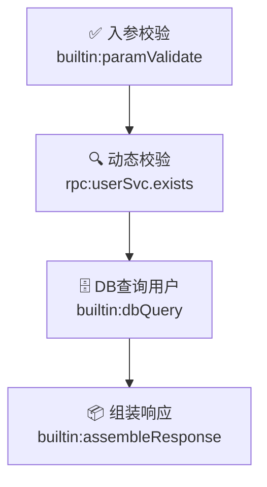
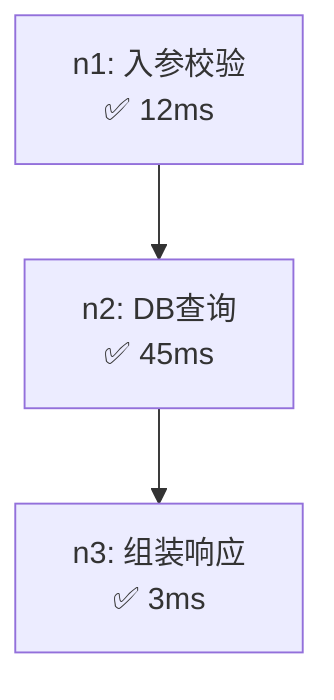

# 函数式工作流配置后台 — 前端技术方案

## 1. 概述

### 1.1 定位

为函数式工作流引擎提供**可视化配置、编排、调试、监控**的管理后台，支撑以下核心场景：

- Schema 声明与管理
- 工作流可视化拖拽编排
- 函数注册与测试
- 版本发布与回滚
- 运行时监控与链路追踪

### 1.2 技术选型

| 类别 | 选型 | 理由 |
|------|------|------|
| **框架** | React 18 + TypeScript | 生态成熟，类型安全，适合复杂交互 |
| **UI 组件库** | Ant Design 5.x | 中后台标杆，表单/表格/布局开箱即用 |
| **应用框架** | Ant Design Pro (Umi 4) | 内置路由、权限、布局、请求方案，减少脚手架工作 |
| **工作流画布** | React Flow 11+ | 轻量、可定制节点/边、社区活跃、TypeScript 友好 |
| **JSON Schema 编辑器** | @rjsf/core + antd theme | 标准 JSON Schema Form 渲染，支持自定义 widget |
| **代码/脚本编辑器** | Monaco Editor | VS Code 同款，支持 Groovy/SpEL/JSON 语法高亮 |
| **状态管理** | Zustand | 轻量、无 boilerplate、支持 devtools |
| **请求层** | Umi Request + SWR | 自动缓存、重试、分页，适合 CRUD 场景 |
| **图表** | ECharts 5 / AntV G2 | 监控面板使用 |
| **构建** | Vite (Umi 4 默认) | 快速 HMR，生产环境 Rollup 优化 |

---

## 2. 项目结构

```
admin-ui/
├── config/                    # Umi 配置
│   ├── config.ts              # 主配置（路由、代理、主题）
│   ├── routes.ts              # 路由定义
│   └── proxy.ts               # 开发代理
├── src/
│   ├── app.tsx                # 运行时配置（请求拦截、权限）
│   ├── layouts/               # 布局组件
│   │   └── BasicLayout.tsx
│   ├── pages/                 # 页面（按业务模块拆分）
│   │   ├── schema/            # Schema 管理
│   │   │   ├── list.tsx       # Schema 列表
│   │   │   ├── editor.tsx     # Schema 编辑器
│   │   │   └── components/
│   │   │       ├── SchemaFormEditor.tsx
│   │   │       ├── SchemaJsonEditor.tsx
│   │   │       └── SchemaPreview.tsx
│   │   ├── workflow/          # 工作流管理
│   │   │   ├── list.tsx       # 工作流列表
│   │   │   ├── designer.tsx   # 工作流画布编排页
│   │   │   ├── detail.tsx     # 工作流详情/版本历史
│   │   │   └── components/
│   │   │       ├── FlowCanvas.tsx        # React Flow 画布容器
│   │   │       ├── NodePalette.tsx       # 左侧节点面板
│   │   │       ├── NodeConfigPanel.tsx   # 右侧节点配置面板
│   │   │       ├── nodes/              # 自定义节点组件
│   │   │       │   ├── ValidateNode.tsx
│   │   │       │   ├── QueryNode.tsx
│   │   │       │   ├── TransformNode.tsx
│   │   │       │   ├── AssembleNode.tsx
│   │   │       │   ├── ScriptNode.tsx
│   │   │       │   ├── ConditionNode.tsx     # 条件分支 (builtin:conditionBranch)
│   │   │       │   ├── ParallelNode.tsx      # DAG 并行执行
│   │   │       │   ├── SubWorkflowNode.tsx   # 子工作流调用
│   │   │       │   ├── EipRouterNode.tsx     # EIP-内容路由/拆分/聚合等
│   │   │       │   └── CustomNode.tsx
│   │   │       ├── edges/              # 自定义连线
│   │   │       │   └── ConditionalEdge.tsx
│   │   │       ├── DecoratorConfigPanel.tsx  # 节点装饰器配置面板
│   │   │       ├── Toolbar.tsx         # 顶部工具栏（保存/发布/调试）
│   │   │       ├── DebugPanel.tsx      # 底部调试面板（Tab: 执行/历史/PinData/Mock/断点）
│   │   │       ├── MockServicePanel.tsx # Mock 外部服务配置
│   │   │       └── NodeTestModal.tsx   # 单节点测试弹窗
│   │   ├── function/          # 函数管理
│   │   │   ├── list.tsx
│   │   │   ├── editor.tsx     # 函数编辑（含脚本编辑器）
│   │   │   └── components/
│   │   │       ├── ScriptEditor.tsx     # Monaco Editor 封装
│   │   │       ├── FunctionTestPanel.tsx # 在线测试运行
│   │   │       └── ExternalServiceForm.tsx
│   │   ├── monitor/           # 监控面板
│   │   │   ├── dashboard.tsx  # 总览
│   │   │   ├── trace.tsx      # 链路追踪详情
│   │   │   └── components/
│   │   │       ├── MetricsChart.tsx
│   │   │       ├── TraceTimeline.tsx
│   │   │       └── NodeListStats.tsx
│   │   ├── system/            # 系统管理
│   │   │   ├── user.tsx       # 用户管理（CRUD + 角色分配）
│   │   │   ├── role.tsx       # 角色管理（CRUD + 权限配置）
│   │   │   └── audit.tsx      # 审计日志（筛选 + 分页）
│   │   └── workflow/
│   │       └── execution.tsx  # 执行历史（列表 + 重放）
│   ├── services/              # API 服务层
│   │   ├── request.ts         # 请求封装（apiGet/apiPost/apiPut/apiDelete）
│   │   ├── schema.ts
│   │   ├── workflow.ts
│   │   ├── function.ts
│   │   ├── monitor.ts
│   │   ├── execution.ts       # 执行历史 + 重放
│   │   ├── audit.ts           # 审计日志
│   │   ├── user.ts            # 用户管理
│   │   ├── role.ts            # 角色管理
│   │   └── instance.ts        # 实例查询
│   ├── stores/                # Zustand 状态管理
│   │   ├── useWorkflowStore.ts
│   │   ├── useSchemaStore.ts
│   │   └── useDebugStore.ts
│   ├── access.ts              # RBAC 权限定义（canView/canEdit/canPublish/canAdmin）
│   ├── hooks/                 # 自定义 Hooks
│   │   ├── useFlowOperations.ts
│   │   ├── useSchemaValidation.ts
│   │   ├── useWorkflowDebug.ts
│   │   └── useDynamicForm.ts  # 元工作流动态表单
│   ├── utils/                 # 工具函数
│   │   ├── jsonSchema.ts
│   │   ├── flowConverter.ts   # WorkflowDefinition ↔ React Flow 互转
│   │   └── expression.ts      # JSONPath/SpEL 表达式解析
│   ├── types/                 # TypeScript 类型定义
│   │   ├── api.ts             # 通用类型（PageResponse, CurrentUser）
│   │   ├── api.generated.d.ts # OpenAPI 自动生成的类型
│   │   ├── schema.ts
│   │   ├── workflow.ts
│   │   ├── function.ts
│   │   └── monitor.ts         # 监控相关类型
│   └── constants/             # 常量
│       ├── nodeTypes.ts
│       ├── errorStrategies.ts
│       └── decorators.ts          # 内置装饰器定义(tx:*/cache:*/persist:*等)
├── public/
├── package.json
├── tsconfig.json
└── .umirc.ts
```

---

## 3. 核心页面设计

### 3.1 Schema 管理

#### 3.1.1 Schema 列表页

```
┌─────────────────────────────────────────────────────┐
│ [+ 新建 Schema]  [从数据库导入]    🔍 搜索...        │
├─────────────────────────────────────────────────────┤
│ 名称          │ 类型    │ 版本 │ 引用数 │ 更新时间 │ 操作│
│ UserInput     │ INPUT   │ v3   │ 5      │ 2h ago │ ✏️🗑️│
│ UserResponse  │ OUTPUT  │ v2   │ 5      │ 1d ago │ ✏️🗑️│
│ OrderShared   │ SHARED  │ v1   │ 12     │ 3d ago │ ✏️🗑️│
└─────────────────────────────────────────────────────┘
```

#### 3.1.2 Schema 编辑器

双模式切换：**可视化表单模式** / **JSON 原始编辑模式**

```
┌──────────────────────────────────────────────────────────┐
│ Schema: UserInput  [表单模式 | JSON模式]  [预览] [保存]   │
├────────────────────────┬─────────────────────────────────┤
│                        │                                 │
│  字段列表               │   JSON Schema 实时预览           │
│  ┌──────────────────┐  │   {                             │
│  │ userId           │  │     "type": "object",           │
│  │ 类型: integer    │  │     "properties": {             │
│  │ 必填: ✅         │  │       "userId": {               │
│  │ 最小值: 1        │  │         "type": "integer",      │
│  │ 描述: 用户ID     │  │         "minimum": 1,           │
│  └──────────────────┘  │         "description": "用户ID" │
│  ┌──────────────────┐  │       }                         │
│  │ username         │  │     },                          │
│  │ 类型: string     │  │     "required": ["userId"]      │
│  │ 必填: ✅         │  │   }                             │
│  │ 正则: ^[a-zA-Z]  │  │                                 │
│  └──────────────────┘  │                                 │
│  [+ 添加字段]          │                                 │
└────────────────────────┴─────────────────────────────────┘
```

**关键实现**：
- 表单模式使用 `@rjsf/core` + `@rjsf/antd` 渲染 JSON Schema 为可编辑表单
- JSON 模式使用 Monaco Editor，带 JSON Schema 校验提示
- 两种模式双向同步，修改任一模式实时更新另一模式
- 「从数据库导入」调用后端 `/api/admin/schemas/import?table=xxx`，自动生成 Schema

### 3.2 工作流画布编排页（核心）

#### 3.2.1 整体布局

```
┌─────────────────────────────────────────────────────────────────┐
│ 📋 查询用户详情  GET /api/users/{userId}  [保存][发布][调试] │
├──────────┬──────────────────────────────────────┬───────────────┤
│          │                                      │               │
│ 节点面板  │          React Flow 画布              │  节点配置面板  │
│          │                                      │               │
│ ┌──────┐ │   (见下方 Mermaid 流程图)             │ 节点: 校验用户 │
│ │✅校验 │ │                                      │ 存在          │
│ ├──────┤ │                                      │               │
│ │🔍查询 │ │                                      │ 函数引用:      │
│ ├──────┤ │                                      │ rpc:userSvc   │
│ │🔄转换 │ │                                      │ .exists       │
│ ├──────┤ │                                      │               │
│ │📦封装 │ │                                      │ 参数配置:      │
│ ├──────┤ │                                      │ userIdExpr:   │
│ │📝脚本 │ │                                      │ $.inputs      │
│ ├──────┤ │                                      │ .userId       │
│ │⚙️自定义│ │                                      │               │
│ └──────┘ │                                      │ 错误策略: FAIL │
│          │                                      │ 超时: 3000ms  │
│          │                                      │               │
│          │                                      │ 装饰器:       │
│          │                                      │ ☑ tx:required │
│          │                                      │ ☑ cache:redis │
│          │                                      │   TTL: 300s   │
│          │                                      │ ☐ persist:*   │
├──────────┴──────────────────────────────────────┴───────────────┤
│ 调试面板 (可折叠)                                                │
│ 入参: {"userId": 123}  [执行]                                   │
│ → n1(校验): ✅ 12ms  → n2(DB查询): ✅ 45ms  → n3(组装): ✅ 3ms │
│ 输出: {"userId":123,"username":"test","email":"..."}            │
└─────────────────────────────────────────────────────────────────┘
```

**画布中展示的工作流示例（Mermaid 标准流程图）：**



#### 3.2.2 自定义节点设计

每种 NodeType 对应一个 React Flow 自定义节点组件：

```tsx
// nodes/ValidateNode.tsx
interface ValidateNodeData {
  label: string;
  functionRef: string;
  errorStrategy: ErrorStrategy;
  timeoutMs: number;
  isValid?: boolean;       // 校验状态（调试后标记）
  durationMs?: number;     // 执行耗时（调试后标记）
}

const ValidateNode: React.FC<NodeProps<ValidateNodeData>> = ({ data, selected }) => {
  return (
    <div className={`node validate-node ${selected ? 'selected' : ''} ${data.isValid === false ? 'error' : ''}`}>
      <Handle type="target" position={Position.Top} />
      <div className="node-icon">✅</div>
      <div className="node-label">{data.label}</div>
      <div className="node-meta">{data.functionRef}</div>
      {data.durationMs !== undefined && (
        <div className="node-badge">{data.durationMs}ms</div>
      )}
      <Handle type="source" position={Position.Bottom} />
    </div>
  );
};
```

#### 3.2.3 数据模型转换

React Flow 的 `nodes/edges` 与后端 `WorkflowDefinition.nodes` 之间需要双向转换：

```typescript
// utils/flowConverter.ts

/**
 * 后端定义 → React Flow 画布数据
 */
export function definitionToFlow(def: WorkflowDefinition): { nodes: Node[]; edges: Edge[] } {
  const nodes = def.nodes.map((node, index) => ({
    id: node.id,
    type: mapNodeTypeToFlowType(node.type),
    position: node.position ?? { x: 300, y: index * 150 }, // 默认纵向排列
    data: {
      label: node.name,
      functionRef: node.functionRef,
      errorStrategy: node.errorStrategy,
      timeoutMs: node.timeoutMs,
      params: node.params,
      decorators: node.decorators,
      decoratorParams: node.decoratorParams,
    },
  }));

  const edges = buildEdgesFromDependencies(def.nodes);
  return { nodes, edges };
}

/**
 * React Flow 画布数据 → 后端定义
 */
export function flowToDefinition(nodes: Node[], edges: Edge[], meta: WorkflowMeta): WorkflowDefinition {
  return {
    ...meta,
    nodes: nodes.map(node => ({
      id: node.id,
      name: node.data.label,
      type: mapFlowTypeToNodeType(node.type),
      functionRef: node.data.functionRef,
      errorStrategy: node.data.errorStrategy,
      timeoutMs: node.data.timeoutMs,
      params: node.data.params,
      decorators: node.data.decorators,
      decoratorParams: node.data.decoratorParams,
      dependsOn: getIncomingNodes(node.id, edges),
      position: node.position, // 保存画布位置，下次打开恢复布局
    })),
  };
}
```

#### 3.2.4 Zustand Store 设计

```typescript
// stores/useWorkflowStore.ts
interface WorkflowState {
  // 画布状态
  nodes: Node[];
  edges: Edge[];
  selectedNodeId: string | null;

  // 工作流元信息
  workflowMeta: Partial<WorkflowDefinition>;

  // 操作
  addNode: (type: NodeType, position: XYPosition) => void;
  removeNode: (id: string) => void;
  updateNodeData: (id: string, data: Partial<NodeData>) => void;
  setSelectedNode: (id: string | null) => void;
  onNodesChange: OnNodesChange;
  onEdgesChange: OnEdgesChange;
  onConnect: OnConnect;

  // 持久化
  loadDefinition: (def: WorkflowDefinition) => void;
  toDefinition: () => WorkflowDefinition;
  save: () => Promise<void>;
  publish: () => Promise<void>;
}

export const useWorkflowStore = create<WorkflowState>((set, get) => ({
  nodes: [],
  edges: [],
  selectedNodeId: null,
  workflowMeta: {},

  addNode: (type, position) => set(state => ({
    nodes: [...state.nodes, createDefaultNode(type, position)],
  })),

  updateNodeData: (id, data) => set(state => ({
    nodes: state.nodes.map(n => n.id === id ? { ...n, data: { ...n.data, ...data } } : n),
  })),

  loadDefinition: (def) => {
    const { nodes, edges } = definitionToFlow(def);
    set({ nodes, edges, workflowMeta: def });
  },

  toDefinition: () => {
    const { nodes, edges, workflowMeta } = get();
    return flowToDefinition(nodes, edges, workflowMeta);
  },
}));
```

#### 3.2.5 节点装饰器配置面板

每个节点的右侧配置面板底部提供「装饰器」区域，支持可视化勾选和参数配置：

```tsx
// components/DecoratorConfigPanel.tsx
interface DecoratorConfigPanelProps {
  nodeId: string;
  decorators: string[];           // 当前已启用的装饰器列表
  decoratorParams: Record<string, any>;  // 各装饰器的参数
  onChange: (decorators: string[], params: Record<string, any>) => void;
}

// 内置装饰器定义（从 constants/decorators.ts 导入）
const BUILTIN_DECORATORS = [
  { name: 'tx:required',       label: '事务-必需',     group: '事务',   params: ['isolation', 'timeout'] },
  { name: 'tx:requiresNew',    label: '事务-新建独立', group: '事务',   params: ['isolation', 'timeout'] },
  { name: 'cache:redis',       label: 'Redis缓存',    group: '缓存',   params: ['cacheKeyExpr', 'ttlSeconds'] },
  { name: 'persist:execution', label: '执行持久化',    group: '审计',   params: ['debugMode', 'sampleRate'] },
  { name: 'retry:exponential', label: '指数退避重试',  group: '容错',   params: ['maxRetries', 'baseDelayMs'] },
  { name: 'ratelimit:slidingWindow', label: '滑动窗口限流', group: '治理', params: ['upLimited', 'cdSeconds', 'recoveryPerCd'] },
  { name: 'log:sanitize',      label: '日志脱敏',     group: '安全',   params: ['fields', 'maskChar'] },
  { name: 'async:ioPool',      label: '异步-IO线程池', group: '异步',  params: [] },
  { name: 'trace:span',        label: 'OpenTelemetry Span', group: '可观测', params: ['spanName'] },
];
```

**关键实现**：
- 按分组展示装饰器列表，每组内可多选（但同组互斥如 tx:required / tx:requiresNew）
- 勾选后展开参数表单，参数 Schema 从后端 `wf_function.config` 动态获取
- 修改实时同步到 Zustand store 的 `node.data.decorators` 和 `node.data.decoratorParams`
- 工作流级事务配置 (`transaction_config`) 在工作流元信息面板中单独配置

### 3.3 函数管理

#### 3.3.1 函数列表

顶部操作栏：`[+ 注册函数]` 筛选: `[全部▾] [内置|自定义|脚本|外部]` 🔍

| 名称 | 类别 | 节点类型 | 状态 | 操作 |
|------|------|---------|------|------|
| builtin:paramValidate | 内置 | PARAM_VALIDATE | ✅ | 👁️ |
| validate:orderAmount | 自定义 | DYNAMIC_VALIDATE | ✅ | ✏️ 🗑️ |
| transform:userToDTO | 自定义 | DATA_TRANSFORM | ✅ | ✏️ 🗑️ |
| script:formatDate | 脚本 | SCRIPT | ✅ | ✏️ 🗑️ |
| rpc:userService | 外部 | DYNAMIC_VALIDATE | ✅ | ✏️ 🗑️ |

#### 3.3.2 脚本函数编辑器

```
┌──────────────────────────────────────────────────────────┐
│ 函数: script:formatDate  引擎: [Groovy ▾]  [测试] [保存] │
├────────────────────────────┬─────────────────────────────┤
│                            │                             │
│  // Groovy 脚本             │  测试面板                    │
│  import java.time.*         │                             │
│                             │  输入:                      │
│  def date = input.date      │  {"date": "2024-01-15"}    │
│  def fmt = params.format    │                             │
│    ?: "yyyy-MM-dd"          │  [执行测试]                  │
│                             │                             │
│  return LocalDate           │  ✅ 执行成功 (8ms)          │
│    .parse(date)             │  输出: "2024-01-15"         │
│    .format(fmt)             │                             │
│                            │  日志:                       │
│                            │  > parsed: 2024-01-15       │
│                            │  > formatted: 2024-01-15    │
└────────────────────────────┴─────────────────────────────┘
```

**Monaco Editor 配置**：
- Groovy: `language: 'groovy'`，注入 `ctx` / `params` / `input` 类型提示
- SpEL: `language: 'plaintext'` + 自定义补全 Provider
- JSON: `language: 'json'` + Schema 校验

### 3.4 监控面板

#### 3.4.1 Dashboard

```
┌─────────────────────────────────────────────────────────────┐
│  今日请求量        成功率           P99 耗时       活跃工作流 │
│  12,458 ↑12%     99.7% ↓0.1%     145ms ↑5ms     23        │
├─────────────────────────────────────────────────────────────┤
│                                                             │
│  📈 请求量趋势 (24h)          📊 节点耗时 Top10             │
│  ┌─────────────────────┐      ┌─────────────────────┐      │
│  │  ╱╲    ╱╲           │      │ db:queryUserById 89ms│      │
│  │ ╱  ╲╱╱  ╲    ╱╲    │      │ rpc:checkStock   67ms│      │
│  │╱         ╲╱╱  ╲╱   │      │ script:format    23ms│      │
│  └─────────────────────┘      └─────────────────────┘      │
│                                                             │
│  ⚠️ 最近错误                                               │
│  14:32 wf_order_create n2(DYNAMIC_VALIDATE) TIMEOUT 3000ms │
│  14:28 wf_user_detail  n3(DATA_QUERY) SQL_ERROR           │
└─────────────────────────────────────────────────────────────┘
```

#### 3.4.2 链路追踪详情页

```
┌─────────────────────────────────────────────────────────────┐
│ Execution: exec_abc123  工作流: 查询用户详情  总耗时: 68ms   │
├─────────────────────────────────────────────────────────────┤
│                                                             │
│  ● n1 校验用户存在     ████████░░░░░░░░  12ms  ✅           │
│    入参: {"userId": 123}                                    │
│    出参: true                                               │
│                                                             │
│  ● n2 查询用户基本信息  ██████████████████  45ms  ✅         │
│    SQL: SELECT `id`,`username`,`email` FROM `t_user` WHERE  │
│         `id` = ?                                            │
│    出参: {"id":123,"username":"test","email":"t@t.com"}     │
│                                                             │
│  ● n3 查询用户角色     ██████░░░░░░░░░░  8ms  ⚠️ FALLBACK  │
│    错误: Connection timeout                                 │
│    降级: 返回空数组                                          │
│                                                             │
│  ● n4 组装响应        ███░░░░░░░░░░░░░  3ms  ✅            │
│    出参: {"userId":123,"username":"test",...}               │
└─────────────────────────────────────────────────────────────┘
```

 ### 3.5 OpenAPI 导入/导出

#### 3.5.1 工作流列表页增加导入导出按钮

顶部操作栏：`[+ 新建工作流]` `[📥 导入 OpenAPI]` `[📤 导出 OpenAPI]` 🔍

| 名称 | 类别 | 协议 | 方法 | 路径 | 事务 | 状态 |
|------|------|------|------|------|------|------|
| 查询用户详情 | BUSINESS | HTTP | GET | /api/users/{id} | REQUIRED | ✅已发布 |
| 创建订单 | BUSINESS | HTTP | POST | /api/orders | REQUIRES_NEW | 📝草稿 |
| 元-函数管理 | META | HTTP | GET | /api/functions | - | 🔒已发布 |

#### 3.5.2 导入预览弹窗

```
┌─────────────────────────────────────────────────────────────┐
│ 📥 导入 OpenAPI 文档                                         │
├─────────────────────────────────────────────────────────────┤
│                                                             │
│ 上传文件: [选择 .json/.yaml 文件]                            │
│                                                             │
│ ─── 解析结果 (共 8 个接口) ─────────────────────────────── │
│ ☑ GET    /api/users          获取用户列表                │
│ ☑ GET    /api/users/{id}     获取用户详情                │
│ ☑ POST   /api/users          创建用户                    │
│ ☑ PUT    /api/users/{id}     更新用户                    │
│ ☐ DELETE /api/users/{id}     删除用户                    │
│ ☑ POST   /api/orders         创建订单                    │
│ ☑ GET    /api/orders/{id}    获取订单详情                │
│ ☑ POST   /api/payments       发起支付                    │
│                                                             │
│ [取消]                                    [确认导入 (7)]    │
└─────────────────────────────────────────────────────────────┘
```

**关键实现**：
- 使用 `Upload` 组件上传 OpenAPI 文件
- 调用 `/api/admin/workflows/import/openapi` 预览解析结果
- 用户勾选后调用 `/api/admin/workflows/import/openapi/confirm` 批量创建
- 导入成功后自动跳转到工作流列表，新工作流为草稿状态

#### 3.5.3 导出配置弹窗

```
┌─────────────────────────────────────────────────────────────┐
│ 📤 导出 OpenAPI 文档                                         │
├─────────────────────────────────────────────────────────────┤
│                                                             │
│ 导出范围:  ○ 全部已发布工作流  ● 选中工作流                  │
│                                                             │
│ 文档信息:                                                    │
│   标题: [My API                     ]                       │
│   版本: [1.0.0                      ]                       │
│                                                             │
│ 包含内容:                                                    │
│   ☑ 入参 Schema                                            │
│   ☑ 响应 Schema                                            │
│   ☑ 接口描述                                               │
│   ☐ 示例值                                                 │
│                                                             │
│ [取消]                                      [下载 .json]    │
└─────────────────────────────────────────────────────────────┘
```

### 3.6 工作流在线调试（核心）

#### 3.6.1 调试面板布局

在工作流画布底部提供可折叠的调试面板，支持**实时编辑入参、执行调试、查看每步输出**：

```
┌─────────────────────────────────────────────────────────────────┐
│ 📋 查询用户详情  GET /api/users/{userId}  [保存][发布][🔍调试] │
├──────────┬──────────────────────────────────────┬───────────────┤
│          │                                      │               │
│ 节点面板  │          React Flow 画布              │  节点配置面板  │
│          │   (见下方 Mermaid 调试流程图)         │               │
│          │                                      │               │
├──────────┴──────────────────────────────────────┴───────────────┤
│ 🔍 调试面板 (点击展开/收起)                                       │
├─────────────────────────────────────────────────────────────────┤
│                                                                 │
│  入参配置 (根据 inputSchema 动态生成表单):                         │
│  ┌─────────────────────────────────────────────────────────┐   │
│  │ userId*: [123        ]  (integer, required)             │   │
│  │ region:  [cn ▾       ]  (enum: cn/us/eu)                │   │
│  │                                                         │   │
│  │ [从JSON粘贴] [重置]                    [▶ 执行调试]      │   │
│  └─────────────────────────────────────────────────────────┘   │
│                                                                 │
│  执行结果:                                                       │
│  ┌─────────────────────────────────────────────────────────┐   │
│  │ 总耗时: 60ms  状态: ✅ 成功                              │   │
│  │                                                         │   │
│  │ 节点执行轨迹:                                            │   │
│  │ ● n1 入参基本校验      ████████░░░░  12ms  ✅            │   │
│  │   输入: {"userId": 123, "region": "cn"}                  │   │
│  │   输出: true                                             │   │
│  │                                                         │   │
│  │ ● n2 查询Redis缓存     ██████████████  45ms  ✅          │   │
│  │   输入: key="user:cn:123"                                │   │
│  │   输出: {"userId":123,"username":"test","email":"..."}  │   │
│  │                                                         │   │
│  │ ● n3 HTTP响应包装      ███░░░░░░░░░  3ms  ✅             │   │
│  │   输入: {"userId":123,...}                               │   │
│  │   输出: {"code":0,"data":{...},"requestId":"xxx"}       │   │
│  └─────────────────────────────────────────────────────────┘   │
│                                                                 │
│  最终输出 (JSON Tree View):                                      │
│  ┌─────────────────────────────────────────────────────────┐   │
│  │ ▼ {                                                     │   │
│  │     "code": 0,                                          │   │
│  │     "message": "success",                               │   │
│  │     "data": {                                           │   │
│  │       "userId": 123,                                    │   │
│  │       "username": "test",                               │   │
│  │       "email": "test@example.com"                       │   │
│  │     },                                                  │   │
│  │     "requestId": "req_abc123",                          │   │
│  │     "timestamp": 1704067200000                          │   │
│  │   }                                                     │   │
│  └─────────────────────────────────────────────────────────┘   │
│                                                                 │
└─────────────────────────────────────────────────────────────────┘
```

**调试时画布上的节点状态（Mermaid 标准流程图）：**



#### 3.6.2 调试面板核心组件

```tsx
// components/DebugPanel.tsx
interface DebugPanelProps {
  workflowId: string;
  inputSchema: JsonSchema;
  onExecute: (input: any) => Promise<DebugResult>;
}

interface DebugResult {
  success: boolean;
  totalDurationMs: number;
  nodeTraces: NodeTrace[];
  finalOutput: any;
  error?: string;
}

interface NodeTrace {
  nodeId: string;
  nodeName: string;
  status: 'SUCCESS' | 'FAILED' | 'SKIPPED' | 'FALLBACK';
  durationMs: number;
  input: any;
  output: any;
  error?: string;
}

const DebugPanel: React.FC<DebugPanelProps> = ({ workflowId, inputSchema, onExecute }) => {
  const [inputData, setInputData] = useState<any>({});
  const [result, setResult] = useState<DebugResult | null>(null);
  const [loading, setLoading] = useState(false);

  // 根据 inputSchema 动态渲染表单
  const renderInputForm = () => (
    <JsonSchemaForm 
      schema={inputSchema} 
      value={inputData} 
      onChange={setInputData}
    />
  );

  const handleExecute = async () => {
    setLoading(true);
    try {
      const res = await onExecute(inputData);
      setResult(res);
      // 更新画布节点的调试状态
      updateCanvasNodesWithTrace(res.nodeTraces);
    } catch (e) {
      message.error('调试执行失败: ' + e.message);
    } finally {
      setLoading(false);
    }
  };

  return (
    <div className="debug-panel">
      {/* 入参配置区 */}
      <div className="debug-input-section">
        <h4>入参配置</h4>
        {renderInputForm()}
        <Button type="primary" onClick={handleExecute} loading={loading}>
          ▶ 执行调试
        </Button>
      </div>

      {/* 执行轨迹区 */}
      {result && (
        <div className="debug-trace-section">
          <h4>执行轨迹 (总耗时: {result.totalDurationMs}ms)</h4>
          <Timeline>
            {result.nodeTraces.map(trace => (
              <Timeline.Item 
                key={trace.nodeId}
                color={trace.status === 'SUCCESS' ? 'green' : 'red'}
              >
                <div className="trace-header">
                  <span>{trace.nodeName}</span>
                  <Tag>{trace.durationMs}ms</Tag>
                  <Tag color={trace.status}>{trace.status}</Tag>
                </div>
                <div className="trace-detail">
                  <JsonView label="输入" data={trace.input} collapsed />
                  <JsonView label="输出" data={trace.output} collapsed />
                  {trace.error && <Alert type="error" message={trace.error} />}
                </div>
              </Timeline.Item>
            ))}
          </Timeline>
        </div>
      )}

      {/* 最终输出区 */}
      {result && (
        <div className="debug-output-section">
          <h4>最终输出</h4>
          <ReactJson src={result.finalOutput} collapsed={1} />
        </div>
      )}
    </div>
  );
};
```

#### 3.6.3 画布节点调试状态标记

调试执行后，画布上的节点会显示执行状态和耗时：

```tsx
// 更新节点数据以反映调试结果
const updateCanvasNodesWithTrace = (traces: NodeTrace[]) => {
  const traceMap = new Map(traces.map(t => [t.nodeId, t]));
  
  setNodes(nodes => nodes.map(node => {
    const trace = traceMap.get(node.id);
    if (!trace) return node;
    
    return {
      ...node,
      data: {
        ...node.data,
        isValid: trace.status === 'SUCCESS',
        durationMs: trace.durationMs,
        status: trace.status,
      },
    };
  }));
};
```

节点视觉反馈：
- ✅ **绿色边框 + 耗时徽章**：执行成功
- ❌ **红色边框 + 错误图标**：执行失败
- ⚠️ **黄色边框**：降级执行（FALLBACK）
- ⏭️ **灰色虚线**：跳过（SKIPPED）

#### 3.6.4 调试 API 接口（前端调用契约）

> 后端实现详见 `fluxion-design.md` §15（调试系统），此处仅定义前端调用契约。

| 接口 | 方法 | 说明 |
|------|------|------|
| `/api/admin/workflows/{id}/debug` | POST | 执行调试，返回 DebugResult（含 snapshot） |
| `/api/admin/workflows/{id}/debug/step` | POST | 传入 snapshot 继续执行下一步 |
| `/api/admin/workflows/{id}/debug/node` | POST | 单节点测试（实时预览用） |

**调试请求**：
```typescript
// POST /api/admin/workflows/{id}/debug
interface DebugRequest {
  inputs: Record<string, any>;       // 工作流入参
  breakpoints?: string[];            // 断点节点ID列表
  mockServices?: MockConfig[];       // Mock 配置
}
```

**调试响应**：
```typescript
interface DebugResult {
  status: 'COMPLETED' | 'PAUSED' | 'FAILED';
  snapshot?: DebugSnapshot;          // ★ 无状态：客户端持有，下次请求回传
  traces: NodeTrace[];               // 节点执行轨迹
  finalOutput?: any;
  totalDurationMs: number;
}
```

**单步执行请求**：
```typescript
// POST /api/admin/workflows/{id}/debug/step
interface StepRequest {
  snapshot: DebugSnapshot;           // ★ 客户端回传上次返回的 snapshot
  breakpoints?: string[];
}
```

**单节点测试请求**：
```typescript
// POST /api/admin/workflows/{id}/debug/node
interface NodeTestRequest {
  nodeId: string;
  inputData?: any;                   // 可选，不传则使用默认值
}
```

#### 3.6.5 调试模式 vs 生产模式

| 维度 | 调试模式 | 生产模式 |
|------|---------|---------|
| 执行日志 | 详细记录每个节点的输入/输出 | 仅记录关键指标 |
| 打点装饰器 | 禁用（避免污染监控数据） | 启用 |
| Schema 校验 | 严格模式（开发环境） | 宽松模式（性能优先） |
| 超时控制 | 放宽（便于排查） | 严格执行 |
| 数据持久化 | 不写入 wf_execution_log | 写入执行日志表 |
| 缓存 | 禁用（确保每次重新执行） | 启用 |

#### 3.6.6 高级调试功能

**单步执行**：
```
[▶ 从头执行] [⏭ 执行下一步] [⏮ 重跑当前节点] [⏹ 停止]
```

**断点调试**：
- 在节点上右键 → 「设为断点」
- 执行到断点节点时暂停，可查看当前 Context 所有变量
- 支持条件断点（如 `$.inputs.userId > 100` 时才暂停）

**Mock 外部服务（函数式 Mock）**：

Mock 不是特殊机制，而是**标准的条件分支 + 数据转换节点**。前端提供可视化配置界面，自动生成对应的节点编排：

```
┌─────────────────────────────────────────────────────────┐
│ 🔧 Mock 配置 (自动生成条件分支节点)                        │
├─────────────────────────────────────────────────────────┤
│                                                          │
│ ☑ rpc:userService.queryById                             │
│   Mock 类型: [静态数据 ▾]                                │
│   ┌─────────────────────────────────────────────────┐   │
│   │ {                                               │   │
│   │   "userId": 999,                                │   │
│   │   "username": "mock_user",                      │   │
│   │   "email": "mock@example.com"                   │   │
│   │ }                                               │   │
│   └─────────────────────────────────────────────────┘   │
│   触发条件: $.inputs.userId == 999                       │
│                                                          │
│ ☐ db:queryUserList (使用真实数据库)                      │
│                                                          │
│ ☑ mq:send                                                │
│   Mock 类型: [脚本生成 ▾]                                │
│   ┌─────────────────────────────────────────────────┐   │
│   │ // Groovy 脚本                                   │   │
│   │ return [                                         │   │
│   │   sent: true,                                    │   │
│   │   messageId: UUID.randomUUID().toString()        │   │
│   │ ]                                                │   │
│   └─────────────────────────────────────────────────┘   │
│                                                          │
│ [应用到工作流] [重置]                                     │
└─────────────────────────────────────────────────────────┘
```

点击「应用到工作流」后，前端自动：
1. 在目标节点前插入**条件判断节点** (`builtin:conditionBranch`)
2. 创建 **Mock 数据转换节点** (`builtin:dataTransform` 或 `builtin:mock`)
3. 更新原节点的依赖关系
4. 保存为新草稿版本（不影响已发布版本）

生成的节点结构示例：
```json
[
  {
    "id": "n2_condition",
    "functionRef": "builtin:conditionBranch",
    "params": {
      "condition": "$.inputs.__mock__ == true && $.inputs.userId == 999"
    },
    "conditionalNexts": [
      { "condition": "$.inputs.__mock__ == true && $.inputs.userId == 999", "target": "n3_mock" },
      { "condition": "true", "target": "n4_real" }
    ]
  },
  {
    "id": "n3_mock",
    "functionRef": "builtin:dataTransform",
    "params": {
      "mapping": {"userId": 999, "username": "mock_user"}
    }
  },
  {
    "id": "n4_real",
    "functionRef": "rpc:userService.queryById"
  }
]
```

> **核心优势**：Mock 是普通节点，可在画布上清晰可见、可复用、可版本化，生产环境也可用于灰度/降级。

#### 3.6.7 开发者体验优化（借鉴 n8n 最佳实践）

参考业界标杆 n8n 的核心设计理念，提升工作流编辑和调试的体验：

##### ① 即时反馈循环（Fast Feedback Loop）

**核心理念**：修改参数时实时看到输出，无需执行整个流程。

```
┌─────────────────────────────────────────────────────────┐
│ 节点配置: n2 DB查询                                       │
├────────────────────────────┬────────────────────────────┤
│                            │                            │
│ 参数设置                    │ 👁️ 实时预览 (自动触发)      │
│ ┌────────────────────────┐ │ ┌────────────────────────┐ │
│ │ table: [t_user       ] │ │ │ ✅ 执行成功 (12ms)     │ │
│ │ fields:                │ │ │                        │ │
│ │   userId: [$.inputs.id]│ │ │ {                      │ │
│ │                        │ │ │   "userId": 123,       │ │
│ │ [测试此节点 ▶]         │ │ │   "username": "test",  │ │
│ └────────────────────────┘ │ │   "email": "..."       │ │
│                            │ │ }                      │ │
│                            │ └────────────────────────┘ │
└────────────────────────────┴────────────────────────────┘
```

**实现要点**：
- ✅ 在节点配置面板右侧增加「实时预览」区域
- ✅ 修改参数时自动触发该节点的 Mock 执行（使用默认/上次输入）
- ✅ 显示输入/输出的 JSON Diff 对比（高亮变化字段）
- ✅ 支持手动点击「测试此节点」按钮强制执行

**后端 API**：
```typescript
// POST /api/admin/workflows/{id}/debug/node
interface NodeTestRequest {
  nodeId: string;
  inputData?: any;  // 可选，不传则使用默认值
}

interface NodeTestResult {
  success: boolean;
  durationMs: number;
  output: any;
  error?: string;
}
```

---

##### ② Pin Data + Replay（数据钉住 + 重放）

**核心理念**：保存每次执行的完整上下文，可随时加载历史数据重新调试。

```
┌─────────────────────────────────────────────────────────┐
│ 📜 执行历史                                              │
├─────────────────────────────────────────────────────────┤
│                                                          │
│ ● 2024-01-15 10:23:45  ✅ 成功  60ms   [加载] [查看]    │
│ ○ 2024-01-15 10:20:12  ❌ 失败  45ms   [加载] [查看]    │
│ ● 2024-01-15 09:15:33  ✅ 成功  58ms   [加载] [查看]    │
│                                                          │
└─────────────────────────────────────────────────────────┘

点击 [加载] 后:
━━━━━━━━━━━━━━━━━━━━━━━━━━━━━━━━━━━━━━━━━━━━━━━━━━━━━━━
✅ 已加载执行记录 #12345

入参表单自动填充:
  userId: [123        ]  ← 从历史记录恢复
  region: [cn ▾       ]

[▶ 使用此数据重新执行]  [✏️ 修改后执行]
━━━━━━━━━━━━━━━━━━━━━━━━━━━━━━━━━━━━━━━━━━━━━━━━━━━━━━━
```

**实现要点**：
- ✅ 保存每次调试执行的完整上下文（输入 + 每步输出 + 最终结果）
- ✅ 提供「执行历史」列表，显示时间/状态/耗时
- ✅ 点击「加载」一键恢复当时的输入数据到表单
- ✅ 支持修改输入后重跑，快速迭代验证
- ✅ 历史记录保留 7 天（可配置），超期自动清理

**数据模型**：
```typescript
interface DebugExecutionRecord {
  id: string;
  workflowId: string;
  timestamp: number;
  status: 'SUCCESS' | 'FAILED';
  totalDurationMs: number;
  input: any;
  nodeTraces: NodeTrace[];
  finalOutput: any;
  errorMessage?: string;
}

// 存储到 IndexedDB（前端本地）或 Redis（后端缓存）
```

**后端 API**：
```typescript
// GET /api/admin/workflows/{id}/debug/history?page=1&size=20
interface HistoryResponse {
  list: DebugExecutionRecord[];
  total: number;
}

// GET /api/admin/workflows/{id}/debug/history/{executionId}
// 返回完整的执行记录详情
```

---

##### ③ 单步执行 + 执行编辑（Execution Edits）

**核心理念**：在执行轨迹中直接编辑某个节点的输入并重跑，无需从头执行。

```
┌─────────────────────────────────────────────────────────┐
│ 🔍 执行轨迹 (总耗时: 60ms)                                │
├─────────────────────────────────────────────────────────┤
│                                                          │
│ ● n1 入参校验      ████████░░░░  12ms  ✅                │
│   输入: {"userId": 123}                                  │
│   输出: true                                             │
│                                                          │
│ ● n2 DB查询        ██████████████  45ms  ✅  ← 点击此处  │
│   ┌─────────────────────────────────────────────────┐   │
│   │ 输入: {"userId": 123}                           │   │
│   │ 输出: {"username": "test", "email": "..."}      │   │
│   │                                                 │   │
│   │ [✏️ 编辑输入]  [🔄 重跑此节点]  [📋 复制输出]    │   │
│   └─────────────────────────────────────────────────┘   │
│                                                          │
│ ● n3 组装响应      ███░░░░░░░░░  3ms   ✅                │
│   输入: {"username": "test", ...}                        │
│   输出: {"code": 0, "data": {...}}                       │
│                                                          │
└─────────────────────────────────────────────────────────┘

点击 [✏️ 编辑输入] 后:
━━━━━━━━━━━━━━━━━━━━━━━━━━━━━━━━━━━━━━━━━━━━━━━━━━━━━━━
┌─────────────────────────────────────────────────────────┐
│ 编辑 n2 的输入数据                                        │
├─────────────────────────────────────────────────────────┤
│ {                                                       │
│   "userId": 456  ← 修改为其他用户ID                     │
│ }                                                       │
│                                                         │
│ [取消]                              [✅ 应用并重跑]      │
└─────────────────────────────────────────────────────────┘

点击 [✅ 应用并重跑] 后:
- 仅重新执行 n2 节点（使用新输入）
- n3 及后续节点自动使用 n2 的新输出
- 更新执行轨迹显示
━━━━━━━━━━━━━━━━━━━━━━━━━━━━━━━━━━━━━━━━━━━━━━━━━━━━━━━
```

**实现要点**：
- ✅ 在执行轨迹的每个节点旁显示「编辑输入」「重跑此节点」按钮
- ✅ 点击「编辑输入」弹出 JSON 编辑器，预填当前输入
- ✅ 点击「重跑此节点」时：
  - 仅执行该节点及其下游节点
  - 上游节点保持原有输出不变
  - 更新 Context 中的节点输出
- ✅ 实时更新执行轨迹和时间线

**后端 API**：
```typescript
// POST /api/admin/workflows/{id}/debug/rerun
interface RerunNodeRequest {
  snapshot: DebugSnapshot; // 客户端持有的调试快照
  nodeId: string;         // 要重跑的节点
  overrideInput?: any;    // 可选，覆盖原输入
}

interface RerunNodeResult {
  updatedTraces: NodeTrace[];  // 从该节点开始的更新后轨迹
  finalOutput: any;
}
```

**前端 Store 设计**：
```typescript
// stores/useDebugStore.ts
interface DebugState {
  // 当前调试快照（无状态：客户端持有，每次请求回传）
  snapshot: DebugSnapshot | null;
  
  // 执行历史
  executionHistory: DebugExecutionRecord[];
  
  // 当前执行结果
  currentResult: DebugResult | null;
  
  // 操作
  loadFromHistory: (executionId: string) => void;
  rerunNode: (nodeId: string, newInput?: any) => Promise<void>;
  editNodeInput: (nodeId: string) => void;
}
```

---

##### 三大体验优化对比

| 特性 | 传统方式 | 优化后（借鉴 n8n） | 效率提升 |
|------|---------|------------------|----------|
| **参数调整** | 修改 → 保存 → 执行整个流程 → 查看结果 | 修改 → 实时预览输出 | 5x |
| **问题复现** | 手动记录输入 → 下次重新填写 | 一键加载历史数据 | 10x |
| **局部调试** | 从头执行 → 等待上游节点 | 直接编辑并重跑目标节点 | 3x |
| **迭代速度** | 分钟级 | 秒级 | 10x+ |

> **核心价值**：将调试循环从「分钟级」缩短到「秒级」，让开发者像使用 IDE 一样流畅地编排工作流。

---

## 4. API 对接规范

### 4.1 接口清单

| 模块 | 方法 | 路径 | 说明 |
|------|------|------|------|
| Schema | GET | `/api/admin/schemas` | 列表（分页+搜索） |
| Schema | POST | `/api/admin/schemas` | 创建 |
| Schema | PUT | `/api/admin/schemas/{id}` | 更新 |
| Schema | DELETE | `/api/admin/schemas/{id}` | 删除 |
| Schema | POST | `/api/admin/schemas/import` | 从数据库表导入 |
| Schema | GET | `/api/admin/schemas/{id}/versions` | 版本历史 |
| Workflow | GET | `/api/admin/workflows` | 列表 |
| Workflow | POST | `/api/admin/workflows` | 创建 |
| Workflow | PUT | `/api/admin/workflows/{id}` | 更新（草稿） |
| Workflow | POST | `/api/admin/workflows/{id}/publish` | 发布 |
| Workflow | POST | `/api/admin/workflows/{id}/rollback` | 回滚到指定版本 |
| Workflow | GET | `/api/admin/workflows/{id}/versions` | 版本列表 |
| Workflow | POST | `/api/admin/workflows/{id}/debug` | 模拟调试执行（无状态，返回 snapshot） |
| Workflow | POST | `/api/admin/workflows/{id}/debug/node` | 测试单个节点（实时预览） |
| Workflow | POST | `/api/admin/workflows/{id}/debug/step` | 继续/单步执行（客户端传入 snapshot） |
| Workflow | POST | `/api/admin/workflows/{id}/debug/rerun` | 重跑指定节点（可覆盖输入） |
| Workflow | GET | `/api/admin/workflows/{id}/debug/history` | 获取调试执行历史列表 |
| Workflow | GET | `/api/admin/workflows/{id}/debug/history/{executionId}` | 获取某次执行的完整记录 |
| Workflow | GET | `/api/admin/workflows/export/openapi` | 导出所有工作流为 OpenAPI |
| Workflow | GET | `/api/admin/workflows/{id}/export/openapi` | 导出单个工作流为 OpenAPI |
| Workflow | POST | `/api/admin/workflows/import/openapi` | 预览 OpenAPI 导入结果 |
| Workflow | POST | `/api/admin/workflows/import/openapi/confirm` | 确认导入 OpenAPI |
| Function | GET | `/api/admin/functions` | 列表 |
| Function | POST | `/api/admin/functions` | 注册 |
| Function | PUT | `/api/admin/functions/{id}` | 更新 |
| Function | POST | `/api/admin/functions/{id}/test` | 在线测试执行 |
| Monitor | GET | `/api/admin/monitor/metrics` | 聚合指标概览 |
| Monitor | GET | `/api/admin/monitor/metrics/trend` | 指标趋势数据（支持 hours/interval 参数） |
| Monitor | GET | `/api/admin/monitor/metrics/node-latencies` | 节点耗时排行（含 p99、调用次数） |
| Monitor | GET | `/api/admin/monitor/traces/{executionId}` | 链路详情 |
| Monitor | GET | `/api/admin/monitor/errors` | 错误日志列表（支持 keyword/时间范围筛选） |
| Execution | GET | `/api/admin/executions` | 执行历史列表（分页+筛选） |
| Execution | GET | `/api/admin/executions/{executionId}` | 某次执行的完整记录（含节点轨迹） |
| Execution | POST | `/api/admin/executions/{executionId}/rerun` | 从指定节点重放执行 |
| Audit | GET | `/api/admin/audit-logs` | 操作审计日志列表（分页+筛选） |
| User | GET | `/api/admin/current-user` | 获取当前用户信息及权限 |
| User | GET | `/api/admin/users` | 用户列表（分页+搜索） |
| User | GET | `/api/admin/users/{userId}` | 用户详情 |
| User | POST | `/api/admin/users` | 创建用户 |
| User | PUT | `/api/admin/users/{userId}` | 更新用户 |
| User | DELETE | `/api/admin/users/{userId}` | 删除用户 |
| Role | GET | `/api/admin/roles` | 角色列表（分页+搜索） |
| Role | GET | `/api/admin/roles/{roleId}` | 角色详情 |
| Role | POST | `/api/admin/roles` | 创建角色 |
| Role | PUT | `/api/admin/roles/{roleId}` | 更新角色 |
| Role | DELETE | `/api/admin/roles/{roleId}` | 删除角色 |
| Instance | GET | `/api/admin/instances` | 已注册业务实例列表 |
| Instance | GET | `/api/admin/instances/groups` | 应用群列表 |

### 4.2 统一响应格式

```typescript
interface ApiResponse<T> {
  code: number;       // 0=成功, 非0=失败
  data: T;
  message: string;
  requestId: string;
}

// 分页
interface PageResponse<T> {
  list: T[];
  total: number;
  page: number;
  pageSize: number;
}
```

### 4.3 请求层封装

```typescript
// services/request.ts
import { request as umiRequest } from '@umijs/max';

export async function apiGet<T>(url: string, params?: Record<string, any>) {
  const res = await umiRequest<ApiResponse<T>>(url, { method: 'GET', params });
  if (res.code !== 0) throw new Error(res.message);
  return res.data;
}

export async function apiPost<T>(url: string, data?: any) {
  const res = await umiRequest<ApiResponse<T>>(url, { method: 'POST', data });
  if (res.code !== 0) throw new Error(res.message);
  return res.data;
}
```

---

## 5. 权限设计

### 5.1 RBAC 模型

| 角色 | Schema | 工作流 | 函数 | 发布 | 监控 | 用户管理 |
|------|--------|--------|------|------|------|----------|
| Viewer | 查看 | 查看 | 查看 | ❌ | 查看 | ❌ |
| Editor | 增删改 | 增删改 | 增删改 | ❌ | 查看 | ❌ |
| Publisher | 增删改 | 增删改 | 增删改 | ✅ | 查看 | ❌ |
| Admin | 全部 | 全部 | 全部 | ✅ | 全部 | ✅ |

### 5.2 前端权限控制

#### 5.2.1 运行时配置（app.tsx）

```typescript
// app.tsx — 启动时获取当前用户信息
export const getInitialState = async () => {
  try {
    const currentUser = await apiGet<CurrentUser>('/api/admin/current-user');
    return { currentUser };
  } catch {
    return { currentUser: MOCK_USER }; // 开发环境降级
  }
};
```

#### 5.2.2 权限定义（access.ts）

```typescript
// access.ts — Umi access 插件读取此文件
export default function access(initialState) {
  const { currentUser } = initialState ?? {};
  const access = currentUser?.access ?? {};
  return {
    canView: !!access.canView,
    canEdit: !!access.canEdit,
    canPublish: !!access.canPublish,
    canAdmin: !!access.canAdmin,
    isAdmin: currentUser?.roles?.includes('Admin') ?? false,
    isEditor: currentUser?.roles?.includes('Editor') ?? false,
  };
}
```

#### 5.2.3 路由级权限

```typescript
// config/routes.ts — 系统管理模块限制 Admin 访问
{
  path: '/system',
  name: '系统管理',
  access: 'canAdmin',
  routes: [
    { path: '/system/user', component: '@/pages/system/user', access: 'canAdmin' },
    { path: '/system/role', component: '@/pages/system/role', access: 'canAdmin' },
    { path: '/system/audit', component: '@/pages/system/audit', access: 'canAdmin' },
  ],
}
```

#### 5.2.4 权限枚举

角色 `permissions` 字段使用以下权限标识：

| 权限标识 | 说明 |
|----------|------|
| `schema:view` / `schema:edit` / `schema:publish` | Schema 查看/编辑/发布 |
| `workflow:view` / `workflow:edit` / `workflow:publish` / `workflow:execute` | 工作流查看/编辑/发布/执行 |
| `function:view` / `function:edit` | 函数查看/编辑 |
| `monitor:view` | 监控面板 |
| `user:manage` / `role:manage` | 用户/角色管理 |
| `audit:view` | 审计日志 |
| `system:admin` | 系统管理 |

---

## 6. 开发规范

### 6.1 组件规范

- 页面组件放 `pages/{module}/`，复用组件放 `components/`
- 每个页面目录下的 `components/` 仅存放该页面专属组件
- 通用组件（如 Monaco Editor 封装、JSON Schema Form）放 `src/components/`
- 所有组件使用函数式 + Hooks，禁止 class component

### 6.2 状态管理规范

| 场景 | 方案 |
|------|------|
| 服务端数据（CRUD） | SWR / useRequest |
| 画布交互状态 | Zustand |
| 表单临时状态 | Ant Design Form |
| 全局用户/权限 | Umi initialState |
| URL 联动状态 | useSearchParams |

### 6.3 TypeScript 规范

- 所有 API 响应、Store、Props 必须有完整类型定义
- 类型定义集中在 `src/types/`
- 禁止 `any`，必要时用 `unknown` + 类型守卫
- React Flow 节点数据类型使用泛型约束

### 6.4 样式规范

- 使用 CSS Modules 或 Ant Design Token
- 画布节点样式可用 CSS-in-JS（styled-components）
- 颜色/间距/字号统一使用 Ant Design Design Token

---

## 7. 实施路线

```mermaid
graph TB
    subgraph P1["Phase 1: 基础框架 + Schema (2周) ✅ 已完成"]
        P1_1["项目初始化<br/>Umi + AntD Pro + 路由 + 权限"]
        P1_2["Schema 列表页"]
        P1_3["Schema 编辑器（双模式）"]
        P1_4["从数据库导入 Schema"]
        P1_5["API 对接联调"]
    end
    
    subgraph P2["Phase 2: 工作流画布 MVP + 调试 (3周) ✅ 已完成"]
        P2_1["React Flow 画布 + 自定义节点<br/>Validate/Query/Transform/Assemble/<br/>Script/Custom/Condition/Parallel/<br/>SubWorkflow/EipRouter"]
        P2_2["节点面板拖拽添加"]
        P2_3["节点配置面板"]
        P2_4["节点装饰器配置面板<br/>tx/cache/persist/retry 等"]
        P2_5["工作流级事务配置"]
        P2_6["画布 ↔ Definition 双向转换"]
        P2_7["保存/加载工作流"]
        P2_8["在线调试面板<br/>①即时反馈 ②Pin+Replay ③单步+编辑"]
    end
    
    subgraph P25["Phase 2.5: 自举基础 (1周)"]
        P25_1["META/BUSINESS 标签区分"]
        P25_2["元工作流删除/禁用保护"]
        P25_3["元工作流编辑二次确认"]
        P25_4["API 响应适配 EngineResult"]
    end
    
    subgraph P3["Phase 3: 函数管理 + 发布 (2周) ✅ 已完成"]
        P3_1["函数列表 + 注册"]
        P3_2["Monaco 脚本编辑器"]
        P3_3["在线测试运行"]
        P3_4["工作流版本管理"]
        P3_5["发布/回滚流程"]
        P3_6["节点选择器绑定函数"]
    end
    
    subgraph P35["Phase 3.5: OpenAPI + MQ + 执行审计 (1.5周) ✅ 已完成"]
        P35_1["OpenAPI 导入/导出"]
        P35_2["MQ 适配器配置页"]
        P35_3["执行历史列表页"]
        P35_4["执行重放功能"]
        P35_5["操作审计日志页"]
        P35_6["API 对接联调"]
    end
    
    subgraph P4["Phase 4: 监控 + 体验优化 (2周) ✅ 已完成"]
        P4_1["Dashboard 指标图表"]
        P4_2["链路追踪时间线"]
        P4_3["错误日志列表"]
        P4_4["画布快捷键 + 撤销/重做"]
        P4_5["工作流模板导入导出"]
        P4_6["响应式适配"]
    end
    
    subgraph P45["Phase 4.5: 自举增强 (1周)"]
        P45_1["动态表单渲染"]
        P45_2["元工作流调试面板"]
        P45_3["元工作流版本对比与回滚 UI"]
    end
    
    P1 --> P2 --> P25 --> P3 --> P35 --> P4 --> P45
```



---

## 8. 关键技术风险与应对

| 风险 | 影响 | 应对 |
|------|------|------|
| React Flow 大规模节点性能 | 50+ 节点卡顿 | 虚拟渲染 + 懒加载节点内容；限制单工作流节点上限 |
| JSON Schema 编辑器复杂度 | 嵌套结构编辑体验差 | 优先保证 JSON 模式可用，表单模式渐进增强 |
| 画布状态与后端数据不一致 | 保存丢失/覆盖 | 乐观更新 + 版本号冲突检测 + 自动保存草稿 |
| Monaco Editor 包体积大 | 首屏加载慢 | 动态 import + Web Worker 加载 |
| 调试执行结果展示 | 深层嵌套数据难阅读 | 集成 react-json-view + 可折叠树形展示 |

---

## 9. 自举（Self-Hosting）对前端的影响

### 9.1 核心变化

由于后端管理 API 本身由元工作流驱动，前端需要适配以下特性：

| 维度 | 传统方式 | 自举方式 |
|------|----------|----------|
| API 契约 | 硬编码接口文档 | 从元工作流的 inputSchema/outputSchema 动态生成 |
| 新增管理页面 | 前后端同步开发 | 配置元工作流后，前端可动态渲染 |
| API 错误格式 | 各 Controller 自定义 | 统一 EngineResult 格式 |
| 调试能力 | 仅业务接口可调试 | 管理接口本身也可在画布中调试 |

### 9.2 动态表单渲染

前端可以利用元工作流的 Schema 动态生成表单，而不是硬编码：

```typescript
// hooks/useDynamicForm.ts
/**
 * 根据元工作流的 inputSchema 动态生成 Ant Design Form
 */
export function useDynamicForm(workflowId: string) {
  const { data: workflow } = useRequest(() => getWorkflow(workflowId));

  // 用 @rjsf/core 将 inputSchema 渲染为表单
  // 用户填写的表单数据直接作为工作流入参提交
  return {
    schema: workflow?.inputSchema,
    submit: (formData: any) => apiRequest(workflow.method, workflow.path, formData),
  };
}
```

### 9.3 元工作流标识与保护

前端需要对元工作流做特殊展示和保护：

```tsx
// 工作流列表页中区分元工作流和业务工作流
<Table
  columns={[
    {
      title: '类型',
      dataIndex: 'category',
      render: (cat) => cat === 'META'
        ? <Tag color="purple">元工作流</Tag>
        : <Tag color="blue">业务工作流</Tag>,
    },
    // ...
  ]}
/>

// 元工作流的删除按钮置灰 + Tooltip 提示
<Button
  disabled={record.isProtected}
  title={record.isProtected ? '核心元工作流禁止删除' : ''}
>
  删除
</Button>
```

### 9.4 元工作流编辑安全确认

编辑元工作流时增加二次确认和完整性校验反馈：

```tsx
// 保存元工作流前的安全确认
const handleSaveMetaWorkflow = async () => {
  Modal.confirm({
    title: '⚠️ 正在修改元工作流',
    content: '元工作流驱动管理后台自身，错误配置可能导致后台不可用。系统会自动备份当前版本，是否继续？',
    okText: '确认修改',
    cancelText: '取消',
    onOk: async () => {
      try {
        await saveWorkflow(definition);
        message.success('保存成功，已自动备份旧版本');
      } catch (e) {
        message.error('完整性校验失败: ' + e.message);
      }
    },
  });
};
```

### 9.5 实施路线调整

在原有 Phase 基础上增加自举相关任务（已合并到上方 §7 Mermaid 图中的 Phase 2.5 和 Phase 4.5）。
