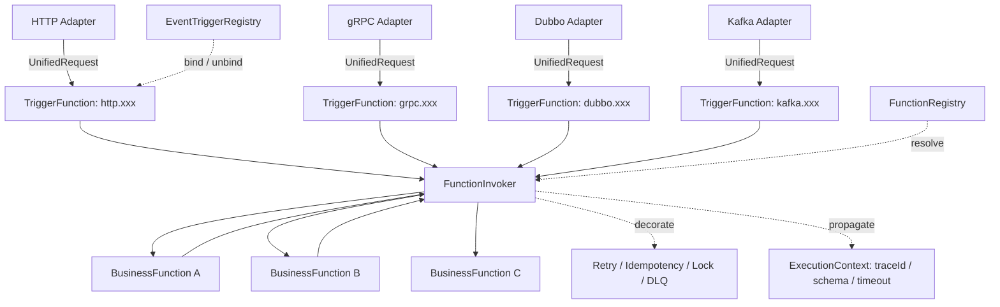

# 触发器函数化与系统扁平化可行性分析

> 文档定位：本文件为**架构演进可行性 / 设计分析**文档，仅描述方案与影响面，不包含可运行的落地实现代码。
> 调研基准：以 `workflow-platform/` 下现有 Kotlin 多模块源码为准（截至 2026-07-08）。
> 落地策略：本文档先产出设计结论；**源码改造后续另开新分支实施**（不在本文档提交范围内）。

---

## 0. 结论速览

将 HTTP / gRPC / Dubbo / Kafka 四类触发器重构为「触发器函数（TriggerFunction）」、把系统扁平化为纯函数集合，**技术上可行且收益明确**，但**真正的改动成本集中在编排层与控制面，而非触发器适配器**。

- 四个协议适配器已统一收敛到 `UnifiedRequest → WorkflowRouter`，改造面很小；
- 函数抽象（`WorkflowFunction` / `FunctionRegistry` / `FunctionComponent`）、触发器 SPI（`EventTrigger` / `EventTriggerRegistry`）、装饰器基础设施（`fluxion-decorator-impl`）**大部分可直接复用**；
- 需新增 `FunctionInvoker` / `TriggerFunction` / `ExecutionContext` 三个核心抽象；
- 风险最高点是 **Admin 画布（DAG 编辑器）**——其前端代码在独立仓库 `workflow-admin-ui`，不在本仓库。

---

## 1. 设计哲学对齐：为什么要扁平化

框架的初衷是：

> 参考 Unix 命令管道与线程工作栈，把可执行代码拆分为**最小单元的函数**；函数的**入参 / 出参都不可变**，从而确保线程安全、减少并发读写带来的性能损耗（空间换时间 + 数据安全）。

当前实现与该哲学存在**偏离**，扁平化不是「为性能砍掉编排层」，而是**对该哲学的忠实还原**：

| 维度 | 设计意图（哲学） | 当前 `DagExecutor` 的实际做法 | 偏离 |
|---|---|---|---|
| 不可变粒度 | 单次函数调用的**栈帧**（调用创建、返回销毁） | 每跑完一个节点就复制**整张工作流状态**（`ImmutableExecutionState`） | 不可变性用在了错误的粒度（整图级而非帧级） |
| 空间换时间 | 不可变值被**多处共享引用**（零拷贝、无锁） | 每个节点完成后 `O(N)` 全量状态拷贝（即便只用到其中一小部分） | 把「空间换时间」变成了「空间换冗余拷贝」 |
| 管道 / 栈帧 | 线性 `f → g → h`，天然线程安全 | 中央状态机调度（`inDegree` 就绪队列 + `select`/`awaitFirst` 协调） | 用「调度器」表达本可用「函数组合」表达的语义 |

**核心论点**：并行分支（用户在后台配置某函数的「下一节点」为多节点，即 fan-out）是真实需求，但它应用「**不可变帧上的 fan-out/join 组合子**」表达，而不是用「中央状态机调度器」表达：

- A 产出一个不可变输出值；fan-out 时 B、C **共享该不可变值的引用**（只读、零拷贝），不可变性保证多读者不会脏读；
- 只有函数真正要「变换出新值」时才产生自己作用域内的新不可变输出；
- 线程安全靠「不可变值 + 共享引用」保证，**不靠锁、也不靠每节点全量快照**。

---

## 2. 现状梳理（以代码为准）

### 2.1 关键事实澄清

调研中发现若干与设想不一致的事实，直接影响方案设计：

1. **`ExecutionContext` 当前不存在**（仅规划文档 `fluxion-design.md` 提及）。实际「执行上下文」由 `ImmutableExecutionState` + `NodeInput` + `ExecutionMeta` 三个类承载。因此「注入 `ExecutionContext`」是**新增项**而非改造现有类。
2. **`WorkflowEdge` 不存在**。DAG 边不是独立模型，而是内嵌在 `WorkflowNode.dependsOn`（DAG 依赖）/ `next` / `conditionalNexts`（线性/条件流）。消除编排层时，这部分语义需迁移到「函数组合」。
3. **`SagaExecutor` 是死代码**：未被任何运行时代码引用（仅 `DagExecutor` 的 `workflowDecorators` 链 + `WorkflowNode.compensateFunctionRef` 通过 `FunctionResult.sideEffects` 在 `WorkflowEngine` 之外工作）。Saga / 事务 / 锁当前实际由 `WorkflowDecorator` 链 + `TransactionDecorator` 承载。
4. **`workflow-admin-ui` 不在本仓库**（根目录无此目录）。本仓库唯一的「画布 / DAG 前端」仅 `docs/fluxion-architecture.canvas.tsx`（设计稿，非运行代码）。后台画布改造需跨仓库协调。
5. **所有协议适配器收敛路径一致**：协议入口 → 构造 `UnifiedRequest` → 注入 `WorkflowRouter`（实现为 `RuntimeWorkflowRouter`）→ `DagExecutor.execute(WorkflowDefinition, ...)`。路由解析逻辑已与协议解耦，正是「触发器函数化」的天然落点。

### 2.2 影响面清单（按模块）

#### A. 需改造

**`fluxion-core`（编排层核心，改动量最大）**

| 文件 | 现状角色 | 改造方向 |
|---|---|---|
| `engine/DagExecutor.kt` | 拓扑排序 + `inDegree` 就绪队列 + `select`/`awaitFirst` 并发协调 + `ImmutableExecutionState` 全量快照 | **弱化 / 移除**，改由「函数组合 + 并发原语」替代 |
| `engine/WorkflowEngine.kt` | `executeNode`（解析 + 装饰器 + Schema 校验 + 超时 + 重试 + DLQ） | **保留纯函数执行内核**，下沉为函数运行时；剥离 `executePartial` / `resolveNextNode` 线性编排 |
| `model/WorkflowDefinition.kt` | 核心模型（约 50 处引用），含 `nodes` / `sortedNodeIds`(`DagTopology.topologicalSort`) / `transactionConfig` / `workflowDecorators` / `sagaEnabled` / `triggers` / `protocol` / `method` / `path` | 拆分：`nodes`(DAG) 移除，改为**函数调用图 DSL**；`protocol/method/path/triggers` / 装饰器 / 事务 / Saga 配置保留为「函数触发器元数据」 |
| `model/WorkflowNode.kt` | `functionRef` / `params` / `decorators` / `timeout` / `retry` / `compensate` + `dependsOn` / `next` / `conditionalNexts` | `functionRef` 等提升为一等函数语义；`dependsOn`/`next` 移除或转组合 DSL |
| `model/WorkflowTrigger.kt` | 触发器枚举 / 配置（当前空壳，未被运行时真正路由） | 作为触发器函数化载体，对接 `EventTriggerRegistry` |
| `engine/control/SubWorkflowExecutor.kt`、`LoopExecutor.kt`、`WaitExecutor.kt` | 已有的「工作流即函数」调用 | 归并到统一的 `FunctionInvoker` 调用模型 |
| `engine/SagaExecutor.kt` | 死代码 | 删除或并入调用级 Saga 装饰器 |

**`fluxion-adapter-spi` + `fluxion-runtime`（路由接缝）**

- `fluxion-adapter-spi/.../AdapterSpi.kt`：`WorkflowRouter` 接口（协议无关桥）
- `fluxion-runtime/.../router/RuntimeInboundRouter.kt`：**核心改造点**，内部 `resolveDefinition + dagExecutor.execute` 改为直接调用触发器函数 + `FunctionInvoker`

**四个协议适配器入口（改造极小，仅依赖 `WorkflowRouter`）**

- `fluxion-adapter-http/webflux/.../WebFluxWorkflowHandler.kt`（已 `inboundRouter.executeSuspend(unifiedRequest)`）
- `fluxion-adapter-http/springmvc/.../MvcWorkflowHandler.kt`
- `fluxion-adapter-rpc/grpc/.../GrpcWorkflowServiceImpl.kt`
- `fluxion-adapter-rpc/dubbo/.../DubboWorkflowServiceImpl.kt`
- `fluxion-adapter-mq/kafka/.../KafkaWorkflowConsumer.kt`

**`fluxion-admin`（控制面，改动量大）**

- `controller/WfDefinitionController.kt`、`ExecutionsController.kt`、`AuditController.kt`、`DebugController.kt`、`WfFunctionController.kt`
- `function/AdminPublishWorkflowFunction.kt`、`AdminDeprecateWorkflowFunction.kt`（发布 / 下线工作流 → 改为发布 / 下线函数）
- `mapper/*`、`service/*`（`WorkflowDefinition` ↔ 存储映射）
- 后台「画布 / DAG 编辑器」实际在**外部仓库 `workflow-admin-ui`**，不在本仓库

#### B. 可复用（不应大改）

| 模块 / 文件 | 说明 |
|---|---|
| `fluxion-adapter-spi/.../event/EventTrigger.kt` | 含 `EventTrigger` 接口 + `EventTriggerRegistry` 类，已与工作流解耦 → 触发器函数化天然落点 |
| `fluxion-core/.../function/WorkflowFunction.kt` | 已有 `andThen` 组合、`functionName`、`fallback` → 函数组合基础设施已具备 |
| `fluxion-core/.../function/FunctionRegistry.kt` | 注册 / 多版本 / 热更新机制，可直接复用 |
| `fluxion-core/.../function/FunctionComponent.kt` | 函数 SPI，第三方函数接入方式不变 |
| `fluxion-core/.../decorator/WorkflowDecorators.kt`、`Decorators.kt` + `fluxion-decorator-impl`（DistributedLockDecorator、TransactionDecorator 等） | 装饰器基础设施已较完整，从「节点级」下沉为「调用级」 |
| `fluxion-function/builtin/.../transaction/TransactionManager.kt`、`TransactionDecorator.kt` | 事务能力，可复用到调用级 |

#### C. 需新增

| 新增抽象 | 说明 |
|---|---|
| `FunctionInvoker` | 按名调用任意函数的统一入口，替代 DAG `dependsOn`/`next` 边与 `SubWorkflowExecutor`；装饰器 / 重试 / 幂等 / DLQ 由它统一包裹 |
| `TriggerFunction` | 一等公民触发器函数，复用 `EventTriggerRegistry` 的 `bind`/`unbind` 生命周期 |
| `ExecutionContext` | 源码中不存在（仅规划文档），替代 `ImmutableExecutionState`，透传 traceId / Schema / 超时 |
| 函数调用图编译 | 将 `WorkflowDefinition.nodes` 编译为「函数组合 DSL + fan-out/join 组合子」 |

---

## 3. 目标架构

### 3.1 架构图



**对比当前架构**：`Adapter → WorkflowRouter → RuntimeWorkflowRouter → DagExecutor → WorkflowEngine.executeNode → resolve(node.functionRef) → WorkflowFunction`，中间编排层在扁平化后被 `FunctionInvoker` 直调取代。

### 3.2 核心抽象（示意，interface 级）

```kotlin
/** 触发器函数：一等公民函数 + 协议绑定生命周期（复用 EventTriggerRegistry 机制） */
interface TriggerFunction : FunctionInvokerAware {
    fun bind()    // 注册到协议路由表 / 订阅事件源
    fun unbind()  // 注销 / 取消订阅
}

/** 统一调用入口：触发器函数与业务函数一致地按名调用任意函数 */
interface FunctionInvoker {
    fun call(functionRef: String, input: FunctionInput): FunctionResult<Any>
}

/** 调用链上下文：替代 ImmutableExecutionState，透传追踪 / 校验 / 超时 / 装饰器 */
interface ExecutionContext {
    val traceId: String
    val invoker: FunctionInvoker
    fun child(ref: String): ExecutionContext
}
```

### 3.3 生命周期统一

- 触发器函数实现 `bind()` / `unbind()`，注册到 `EventTriggerRegistry`（现有 SPI）及协议绑定表；
- 业务函数沿用 `FunctionRegistry` 的注册 / 注销 / 热更新；
- 二者生命周期都收敛到「**注册即生效、注销即失效**」，无需为「触发器层」与「节点层」分别维护启动 / 订阅 / 注销逻辑。

### 3.4 跨函数调用

- `FunctionInvoker.call(ref, input)` 替代 DAG `dependsOn` / `next` 边与 `SubWorkflowExecutor`；
- 装饰器（NodeDecorator）、重试、幂等、DLQ 从「节点级」下沉为「调用级」，由 `FunctionInvoker` 统一包裹；
- 并行分支（fan-out）：A 完成后由 `FunctionInvoker` **并发**调用 B、C，二者共享 A 输出的不可变值引用（零拷贝）；join 由汇聚函数 `await` 多个 future 后合并。

### 3.5 链路追踪

- 用 `ExecutionContext` 注入 W3C `traceparent`，每次 `invoker.call` 生成父子 span，形成**连续调用树**，替代当前的「工作流实例 ID + 节点 ID」两段式；
- `ExecutionTracker` / `ExecutionSnapshotStore` 改为**调用树存储**。

### 3.6 `apply` 签名演化（breaking 决策）

现有 `WorkflowFunction.apply(NodeInput)` 不含跨调用能力。两种方案：

1. 向 `NodeInput` 注入 `ExecutionContext`（含 `FunctionInvoker`），保持 `apply` 签名稳定；
2. 需要跨调用的函数通过 DI 注入 `FunctionInvoker`。

**推荐方案 ①**：降低第三方 `FunctionComponent` 迁移成本（签名不变，仅 `NodeInput` 多携带上下文）。

---

## 4. 四维度评估（收益 / 风险对照）

### 4.1 架构统一性

| | 当前 | 扁平化后 |
|---|---|---|
| 入口与业务 | 触发器各自维护启动 / 订阅 / 注销；业务走 `WorkflowFunction.apply(NodeInput)`，抽象不统一 | 所有入口与业务共用 `WorkflowFunction<O>` 签名，注册 / 解析 / 多版本 / 热更新全走 `FunctionRegistry` |
| 装饰器 | 触发器层与节点层各写一遍 | 一处实现、全部复用（`FunctionInvoker` 统一包裹） |
| 收益 | — | 触发器函数 = 管道入口（stdin），业务函数 = 管道 stage，`FunctionInvoker` = 管道连接符 |

### 4.2 可维护性

| | 当前 | 扁平化后 |
|---|---|---|
| 调用链路 | 适配器 → `WorkflowRouter` → `DagExecutor` → `WorkflowEngine.executeNode` → `FunctionRegistry.resolve`（链路长、难推理） | 适配器 → `FunctionInvoker` → `apply`（链路短、易推理） |
| 依赖表达 | 依赖声明藏在 `WorkflowDefinition` 的 `List<WorkflowNode>` 中 | 用 `FunctionInvoker` + 声明式调用图（deps）表达，可**静态分析 / 可视化 / 影响面评估** |
| 追踪 | 「工作流实例 ID + 节点 ID」两段式 | `traceparent` 随帧传递，连续调用栈 |
| 风险 | — | 依赖由「显式 DAG 边」变为「函数内调用」，**隐式化**，需靠调用图静态扫描工具补偿 |

### 4.3 性能收益

| 开销项 | 当前 | 扁平化后 |
|---|---|---|
| `sortedNodeIds` 拓扑排序 | 即便单节点也要算 | 单链无需排序；并行分支仅对 fan-out 子图排序 |
| `ImmutableExecutionState` 全量快照 | 每节点完成 `O(N)` 复制（GC 压力） | **去除**：不可变下沉到调用帧级；并行分支共享不可变值引用（零拷贝） |
| `inDegree` 就绪队列 + `select`/`awaitFirst` | 单链也走并发协调 | 单链退化为顺序调用；并发仅发生在显式 fan-out |
| `WorkflowEngine.executeNode` 重复包裹 | 「编排层 → 节点层」重复装饰器 / Schema 校验 | `FunctionInvoker` 单一包裹 |

> 说明：性能收益的本质不是「去掉不可变」，而是「**不可变从整图状态级下沉到调用帧级**」，并去掉原本为并行调度存在、但单链调用用不到的协调开销。

### 4.4 扩展性

| | 当前 | 扁平化后 |
|---|---|---|
| 接入新触发器 | 新建 adapter 模块 + 改 `WorkflowTrigger` 枚举 + 改 `RuntimeWorkflowRouter` 映射 + 适配器自管订阅生命周期（**改核心路由 + 新模块**） | 实现一个 `TriggerFunction`（与现有 `FunctionComponent` SPI 一致）注册进 `FunctionRegistry` 即可（**加一个函数**） |
| 接入成本 | 高（动核心） | 低（注册即生效） |

---

## 5. 增量迁移路线

保留回退开关，分阶段推进：

| 阶段 | 目标 | 关键动作 | 回退开关 |
|---|---|---|---|
| **阶段 0** | 兼容层保留 | `DagExecutor` 原样保留，作为默认执行器 | `feature.flatten.enabled=false`（默认） |
| **阶段 1** | 单节点工作流免 DAG | 单节点（触发器直接驱动一个函数）走 `FunctionInvoker` 直调，跳过 `DagExecutor` | 按 `WorkflowDefinition.nodes.size == 1` 路由 |
| **阶段 2** | 触发器函数化 | 四类触发器注册为 `TriggerFunction`，接入 `EventTriggerRegistry` | 按 `protocol` 选择旧路由 / 新触发器 |
| **阶段 3** | 逐步下掉编排层 | 多节点工作流编译为函数调用图 + fan-out/join；`DagExecutor` / `WorkflowEngine` 线性编排剥离；`SagaExecutor` 删除 | `feature.flatten.enabled=true` 全量；保留 `DagExecutor` 至阶段 3 完成后再删 |

---

## 6. 关键接口改动清单

### 6.1 新增

- `TriggerFunction`（复用 `EventTrigger` / `EventTriggerRegistry` 的 `bind`/`unbind`）
- `FunctionInvoker.call(ref, input)`（统一调用入口）
- `ExecutionContext`（替代 `ImmutableExecutionState`）
- 函数调用图编译（DSL + fan-out/join 组合子）

### 6.2 改造

- `WorkflowDefinition`：移除 `nodes` / `sortedNodeIds`，新增「函数调用图」字段；保留 `protocol` / `method` / `path` / `triggers` / `transactionConfig` / `workflowDecorators` / `sagaEnabled` 等元数据
- `WorkflowNode`：`functionRef` / `params` / `decorators` / `timeout` / `retry` / `compensate` 提升为一等函数语义；移除 `dependsOn` / `next` / `conditionalNexts`
- `RuntimeWorkflowRouter`：内部 `resolveDefinition + dagExecutor.execute` 改为「解析触发器函数 + `FunctionInvoker` 直调」
- `WorkflowEngine`：保留 `executeNode` 纯函数执行内核，下沉为函数运行时

### 6.3 迁移映射

| 机制 | 当前 | 扁平化后 |
|---|---|---|
| 节点依赖 | `WorkflowNode.dependsOn` / `next` | `FunctionInvoker.call` / 函数组合 DSL |
| 子工作流 | `SubWorkflowExecutor` | `FunctionInvoker.call(ref, input)` |
| 装饰器 / 重试 / 幂等 / DLQ | 节点级 `NodeDecorator` | 调用级，由 `FunctionInvoker` 包裹 |
| 追踪 | `ImmutableExecutionState` + 实例/节点 ID | `ExecutionContext.traceparent` 调用树 |
| Saga / 事务 / 锁 | `sagaEnabled` / `transactionConfig` / `WorkflowDecorator` | 调用级装饰器（`TransactionDecorator` / `DistributedLockDecorator` 等） |

---

## 7. 风险与回退策略

### 7.1 Admin 画布改造成本（最高风险，跨仓库）

- 后台「拖拽连线下一节点」的用户心智**保留**，但其底层从「生成 `WorkflowDefinition` 交给 `DagExecutor`」改为「编译为函数调用图 + fan-out/join 组合子」；
- 前端代码在独立仓库 `workflow-admin-ui`（本仓库无），需跨仓库协调，改造 / 替代成本最高；
- 回退：阶段 0–2 保留旧画布与 `DagExecutor`；阶段 3 才切换画布编译目标。

### 7.2 循环调用防护

- 扁平化后函数可互相调用，存在 A → B → A 循环风险；
- 防护：在 `ExecutionContext` 维护调用栈（visited functionRef 集合），`FunctionInvoker.call` 前检测环并拒绝 / 熔断；或在函数调用图编译期做静态环检测。

### 7.3 Saga / 事务 / 锁替代

- 当前 Saga / 事务由 `sagaEnabled` / `transactionConfig` / `WorkflowDecorator` 在编排层提供；
- 扁平化后用「**函数组合 + 调用级装饰器**」重建：`TransactionDecorator` / `DistributedLockDecorator` 已存在于 `fluxion-decorator-impl`，可复用到调用级；
- `SagaExecutor` 为死代码，阶段 3 直接删除，补偿逻辑由 `WorkflowNode.compensateFunctionRef` + `FunctionResult.sideEffects` + 调用级 Saga 装饰器承接。

### 7.4 其他

- `WorkflowEdge` 不存在，无需处理；其语义在 `WorkflowNode.dependsOn` / `next` 中，随节点模型改造一并迁移；
- `apply` 签名演化（第 3.6 节）为 breaking change，第三方 `FunctionComponent` 需评估迁移成本（推荐方案 ① 以最小化影响）。

---

## 8. 结论

扁平化**在架构上是对框架自身「管道 / 栈帧」哲学的忠实还原**，而非单纯的性能优化；触发器函数化、统一调用入口（`FunctionInvoker`）、调用级装饰器与追踪，均有可直接复用的现有抽象支撑。

主要阻力不在触发器适配器（收敛良好），而在：

1. `WorkflowDefinition` / `DagExecutor` 等编排层模型的拆分与 `WorkflowEngine` 执行内核的下沉（改动量大）；
2. `fluxion-admin` 控制面与**跨仓库的 Admin 画布**改造（风险最高）。

建议按第 5 节分阶段、带回退开关推进，且**源码改造在独立新分支实施**（本文档仅交付设计结论）。
